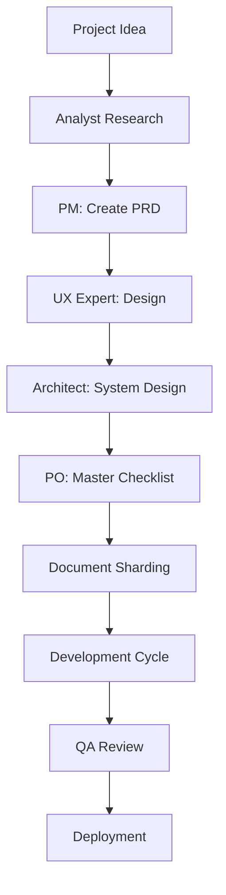
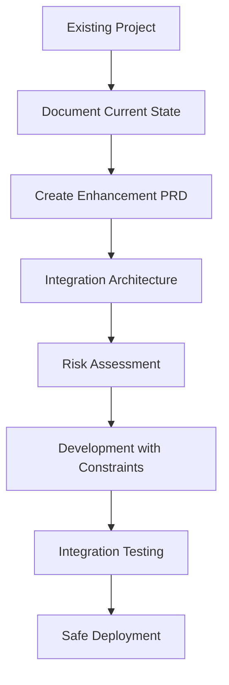

# Professional Development Workspace

A comprehensive, production-ready development environment designed for teams to build high-quality software efficiently. This workspace provides everything your team needs to start developing immediately with best practices built-in.

## 🚀 Quick Start (< 5 minutes)

```bash
# 1. Clone this workspace
git clone https://github.com/your-org/my-dev-workspace.git
cd my-dev-workspace

# 2. Install dependencies
npm install

# 3. Create your first project
node scripts/new-project.js my-awesome-app web

# 4. Start developing
cd projects/my-awesome-app
npm install
npm run dev
```

**That's it!** Your professional development environment is ready with security, testing, and best practices pre-configured.

## 🎓 Team Onboarding & Setup Wizard

### 🚀 Interactive Setup Experience
New to the workspace? Start with our intelligent setup wizard that personalizes your environment:

```bash
# Launch the interactive setup wizard
/project:setup-wizard

# Role-specific quick setup
/project:setup-wizard --role=frontend
/project:setup-wizard --role=backend
/project:setup-wizard --role=fullstack
/project:setup-wizard --role=mobile
```

### 📚 Guided Workspace Tour
Discover all features with our comprehensive 15-minute tour:

```bash
# Complete guided tour
/project:workspace-tour

# Feature-specific tours
/project:tour --feature=agents      # Meet your AI team
/project:tour --feature=templates   # Explore templates
/project:tour --feature=security    # Security features
/project:tour --feature=collaboration # Team features
```

### 📊 Onboarding Progress Tracking
Track your setup progress and unlock achievements:

```bash
# Check your onboarding progress
/project:onboarding-status

# Get personalized next steps
/project:next-steps

# Celebrate achievements
/project:onboarding-celebrate
```

### 🎯 5-Phase Onboarding Journey

| Phase | Focus | Duration | Key Outcomes |
|-------|-------|----------|--------------|
| **Phase 1** | Initial Setup | 30 min | IDE configured, preferences set, security enabled |
| **Phase 2** | Tool Configuration | 45 min | Agents activated, templates explored, automation setup |
| **Phase 3** | First Project | 2-3 hours | Complete project built with AI assistance |
| **Phase 4** | Team Integration | 1 hour | Collaboration tools, team workflows |
| **Phase 5** | Advanced Features | 1 hour | Power-user features, optimization mastery |

### 🏆 Achievement System
Unlock achievements as you master the workspace:

- **🛠️ Setup Mastery**: Complete personalized configuration
- **👨‍💻 Development Skills**: Build projects with templates and agents
- **🤖 Agent Collaboration**: Master AI-assisted development
- **🛡️ Security Champion**: Achieve enterprise security standards
- **📚 Learning Journey**: Continuous improvement and knowledge sharing

## ✨ What You Get Out of the Box

### 🏗️ **Production-Ready Project Templates**
- **Web Apps**: React + TypeScript + Vite + Security
- **APIs**: Node.js + TypeScript + Express + Auth
- **Python**: FastAPI + Async + Security + Testing
- **Java**: Spring Boot + Security + Monitoring
- **Go**: Gin + High Performance + Security
- **Mobile**: React Native (Coming Soon)
- **Desktop**: Electron (Coming Soon)

### 🛡️ **Security-First Development**
- Built-in security scanning and validation
- Automated vulnerability detection
- Security-first templates and configurations
- CI/CD pipelines with security gates

### 🤖 **AI-Enhanced Development**
- 21 specialized AI agents for different development tasks
- Automated code review and quality assurance
- AI-powered testing and documentation
- Intelligent project management and planning

### ⚙️ **Professional Configuration Management**
- Centralized configuration system
- Zero redundancy across projects
- Consistent code quality standards
- Automated validation and synchronization

## 📁 Project Structure

```
my-dev-workspace/
├── projects/                 # Your team's projects go here
├── templates/               # Production-ready templates
│   ├── web/                # React + TypeScript template
│   ├── api/                # Node.js + Express template  
│   ├── python/             # FastAPI template
│   ├── java/               # Spring Boot template
│   └── go/                 # Gin template
├── scripts/                # Automation scripts
├── config/                 # Centralized configurations
├── docs/                   # Team documentation
└── tools/                  # Development utilities
```

## 🛠️ Creating New Projects

### Available Project Types

```bash
# Web Application (React + TypeScript)
node scripts/new-project.js frontend-app web

# REST API (Node.js + Express)
node scripts/new-project.js backend-api api

# Python API (FastAPI)
node scripts/new-project.js python-service python

# Java Service (Spring Boot)
node scripts/new-project.js java-service java

# Go Service (Gin)
node scripts/new-project.js go-service go
```

### What Each Template Includes

| Template | Framework | Features |
|----------|-----------|----------|
| **Web** | React + TypeScript | Vite, ESLint, Prettier, Vitest, Security Headers |
| **API** | Node.js + Express | Auth, Validation, Rate Limiting, Security Middleware |
| **Python** | FastAPI | Async, Pydantic, pytest, Security, Docker |
| **Java** | Spring Boot | Security, JPA, Testing, Monitoring, Docker |
| **Go** | Gin | High Performance, Security, Testing, Docker |

## 🚦 Development Workflow

### 1. **Planning Phase**
```bash
# Use AI agents for project planning
/analyst    # Market research and requirements
/pm         # Project management and coordination
/architect  # Technical architecture design
```

### 2. **Development Phase**
```bash
# Start development with built-in quality
npm run dev          # Start development server
npm run test         # Run tests (TDD supported)
npm run lint         # Code quality checks
npm run security     # Security scanning
```

### 3. **Quality Assurance**
```bash
# AI-powered quality assurance
npm run test:coverage    # Coverage reports
npm run audit           # Dependency auditing
npm run build           # Production build
npm run deploy:staging  # Staging deployment
```

## 🤖 AI Development Teams

### Custom Development Agents
- **spec-analyst**: Requirements analysis and user stories
- **spec-architect**: System design and architecture
- **frontend-developer**: UI/UX implementation
- **backend-developer**: Server-side development
- **security-specialist**: Security analysis and validation
- **spec-tester**: Testing strategies and validation
- **spec-reviewer**: Code review and quality assurance

### Strategic Planning Agents (BMAD)
- **/analyst**: Market research and competitive analysis
- **/pm**: Product management and coordination
- **/architect**: Technical architecture planning
- **/dev**: Development coordination
- **/qa**: Quality assurance validation

### Usage Example
```bash
# Strategic planning sequence
/analyst → /pm → /architect → /po

# Technical implementation
spec-analyst → spec-architect → frontend-developer + backend-developer

# Quality validation  
spec-tester → spec-reviewer → security-specialist
```

## 🔧 Configuration Management

### Centralized System Benefits
- **Consistent Quality**: Same standards across all projects
- **Easy Updates**: Change configs once, update everywhere
- **Zero Redundancy**: No duplicate configuration files
- **Automated Validation**: Real-time consistency checking

### Configuration Structure
```
config/
├── base/                    # Shared base configurations
│   ├── eslint.base.js      # Common linting rules
│   ├── typescript.base.json # TypeScript standards
│   └── prettier.base.js     # Code formatting
├── templates/              # Template-specific overrides
└── validation/             # Automated validation tools
```

## 🛡️ Security Features

### Built-in Security
- **Automated Scanning**: Vulnerability detection in dependencies
- **Security Headers**: Pre-configured security headers
- **Auth Templates**: Ready-to-use authentication patterns
- **Input Validation**: Built-in validation for all inputs
- **Security Testing**: Automated security test suites

### Security Workflow
```bash
npm run security:scan    # Scan for vulnerabilities
npm run security:audit   # Audit dependencies  
npm run security:test    # Run security tests
npm run security:report  # Generate security report
```

## 📊 Performance & Metrics

### Workspace Performance
- **Configuration Redundancy**: <20% (industry best practice)
- **Setup Time**: <5 minutes for new projects
- **Build Performance**: Optimized for speed
- **Team Productivity**: 21 AI agents + automation

### Quality Metrics
- **Code Coverage**: >90% target across all templates
- **Security Score**: A+ rating with built-in scanning
- **Performance**: Web Vitals optimized templates
- **Maintainability**: Centralized configuration management

## 🔗 IDE Integration

### Supported IDEs
- **VS Code**: Full integration with extensions
- **Cursor**: Advanced AI-powered development
- **JetBrains**: WebStorm, IntelliJ, PyCharm
- **Windsurf**: Next-generation AI development

### Features
- **Intelligent Code Completion**: AI-powered suggestions
- **Real-time Error Detection**: Immediate feedback
- **Integrated Testing**: Run tests from IDE
- **Security Highlighting**: Security issue detection

## 🚀 CI/CD & Deployment

### GitHub Actions Workflows
- **Code Quality**: Automated linting and testing
- **Security Scanning**: Vulnerability detection
- **Build Validation**: Multi-environment testing
- **Deployment**: Automated staging and production
- **Monitoring**: Performance and error tracking

### Deployment Targets
- **Staging**: Automatic deployment on PR merge
- **Production**: Manual approval process
- **Preview**: Branch-based preview deployments
- **Rollback**: One-click rollback capabilities

## 📚 Documentation & Learning

### Team Resources
- **Getting Started Guide**: [docs/WORKSPACE_GUIDE.md](docs/WORKSPACE_GUIDE.md)
- **Best Practices**: [docs/knowledge-base/best-practices/](docs/knowledge-base/best-practices/)
- **Architecture Patterns**: [docs/knowledge-base/patterns/](docs/knowledge-base/patterns/)
- **Troubleshooting**: [docs/knowledge-base/troubleshooting/](docs/knowledge-base/troubleshooting/)

### Development Protocols
- **Security-First Development**: Security built into every step
- **Test-Driven Development**: Tests drive implementation
- **Code Review Process**: AI + human code review
- **Documentation Standards**: Automated documentation generation

## 🤝 Team Collaboration

### Multi-Agent Coordination
- **Shared Workspace**: `.bmad-workspace/` for team coordination
- **Context Handoffs**: Seamless agent-to-agent communication
- **Quality Gates**: Automated quality checkpoints
- **Progress Tracking**: Real-time project status

### Team Standards
- **Code Style**: Enforced through automated tools
- **Commit Messages**: Conventional commit format
- **Branch Strategy**: GitFlow with AI assistance
- **Documentation**: Auto-generated and maintained

## ⚡ Advanced Features

### External Tool Integration
- **Rule2Hook**: Natural language automation rules
- **Semgrep**: Advanced security scanning
- **Serena**: Semantic code analysis
- **Claude Code**: AI-powered development assistant

### Custom Scripts
```bash
node scripts/new-project.js <name> <type>  # Create new project
node scripts/config-validator.js           # Validate configurations
node scripts/ai-security/setup.js         # Setup security scanning
node scripts/bmad-performance-tracker.js  # Track team performance
```

## 🔮 Future Roadmap

### Upcoming Features
- **Mobile Templates**: React Native + Flutter
- **Desktop Templates**: Electron + Tauri
- **DevOps Templates**: Kubernetes + Docker
- **Data Science Templates**: Jupyter + MLOps
- **Game Development**: Unity + Godot templates

### Advanced Intelligence
- **Predictive Analytics**: AI-powered project insights
- **Automated Refactoring**: Intelligent code improvements
- **Performance Optimization**: AI-driven optimization
- **Security Intelligence**: Proactive threat detection

## 🆘 Getting Help

### Quick Help
```bash
# Get help with workspace commands
npm run help

# Validate your setup
npm run validate

# Check system health
npm run health-check
```

### Team Support
- **Documentation**: Comprehensive guides in `docs/`
- **Examples**: Working examples in each template
- **AI Assistance**: Ask questions to AI agents
- **Issue Tracking**: GitHub Issues for bug reports

### Common Commands
```bash
# Project management
node scripts/new-project.js           # Create new project
npm run lint                          # Check code quality
npm run test                          # Run tests
npm run build                         # Build for production

# Team coordination
npm run team:status                   # Check team progress
npm run team:sync                     # Sync configurations
npm run team:validate                 # Validate team setup
```

## 🎮 Claude Code Command Center

The workspace includes 40+ specialized commands available in Claude Code for advanced workflows:

### 🚀 **Quick Access Commands**
```bash
# Setup & Onboarding
/project:setup-wizard              # Interactive setup wizard
/project:workspace-tour            # Guided feature tour
/project:onboarding-status        # Track progress

# Development Assistance  
/project:context-switching         # Smart context management
/project:intelligent-workflows     # AI-powered workflows
/project:predictive-assistance     # Predictive coding help

# Team Collaboration
/project:bmad-orchestrator        # Enterprise agent coordination
/project:team-sync                # Multi-agent collaboration
/project:knowledge-share          # Share insights and patterns
```

### 🤖 **BMAD Agent Commands**
```bash
# Strategic Planning Agents
/analyst      # Market research and competitive analysis
/pm           # Product management and coordination  
/architect    # Technical architecture and design
/po           # Product owner responsibilities

# Development Coordination
/dev          # Development coordination and oversight
/ux-expert    # User experience and design
/qa           # Quality assurance and testing
/sm           # Scrum master and agile facilitation
```

### 📚 **Knowledge & Learning Commands**
```bash
/project:contextual-help          # Context-aware assistance
/project:ai-security-review       # Security analysis and review
/project:intelligent-config       # Smart configuration management
/project:ultimate-dx-integration  # Developer experience optimization
```

### 💡 **Pro Tips for New Team Members**
- **Start with the setup wizard** - It personalizes your environment in minutes
- **Take the guided tour** - Discover features you didn't know existed  
- **Use achievement tracking** - Gamify your learning experience
- **Ask agents for help** - Your AI team is always ready to assist
- **Bookmark useful commands** - Build your personal workflow shortcuts

## 🎯 BMAD-METHOD: Enterprise AI Development Framework

The workspace includes the complete **BMAD-METHOD v4.36.2** - a professional AI-driven development framework that can be used as an integrated feature or as a standalone development methodology.

### 🚀 **What is BMAD-METHOD?**

BMAD (Business-Managed Agile Development) is a structured methodology that combines:
- **AI-Driven Planning**: Strategic agents handle requirements, architecture, and project management
- **Systematic Development**: Structured workflows from concept to deployment
- **Quality Assurance**: Built-in testing, review, and validation processes
- **Brownfield Support**: Works with existing projects and legacy systems

### 🎬 **Two Development Workflows**

#### **Greenfield Development** (New Projects)
Complete structured approach for new projects:



#### **Brownfield Development** (Existing Projects)
Systematic approach for enhancing existing systems:



### 🤖 **BMAD Agent Team Structure**

#### **Strategic Planning Agents**
- **/analyst**: Market research, competitive analysis, project briefs
- **/pm**: Product management, PRD creation, epic/story management
- **/architect**: System architecture, technical design, integration planning
- **/po**: Product owner, validation, master checklist execution

#### **Development Coordination Agents**
- **/dev**: Development coordination and task execution
- **/ux-expert**: User experience design and frontend specifications
- **/qa**: Quality assurance, testing, and code review
- **/sm**: Scrum master, sprint planning, team coordination

#### **Meta-Management Agents**
- **/bmad-master**: Can perform any task, explains BMAD methodology
- **/bmad-orchestrator**: Heavy-weight agent for complex coordination

### 📋 **BMAD Workflow Commands**

#### **Planning Phase Commands**
```bash
# Complete planning workflow
/analyst → /pm → /architect → /po

# Specific planning tasks
/analyst *create-project-brief      # Market research and project definition
/pm *create-prd                     # Product Requirements Document
/architect *create-architecture     # System design and tech stack
/po *execute-checklist             # Validation and alignment check
```

#### **Development Phase Commands**
```bash
# Core development cycle
/sm *draft-next-story              # Story creation from epics
/dev *implement-story              # Sequential task execution
/qa *review-story                  # Quality assurance review

# Document management
/po *shard-documents               # Break large docs into focused files
/po *validate-story                # Story validation against artifacts
```

#### **Brownfield-Specific Commands**
```bash
# Existing project enhancement
/architect *document-project        # Document current system state
/pm *create-brownfield-prd         # Enhancement requirements
/architect *create-brownfield-architecture  # Integration-focused design
/pm *create-brownfield-epic        # Quick epic for focused changes
/pm *create-brownfield-story       # Single story for small changes
```

### 🔧 **BMAD Configuration**

The BMAD system is configured via `.bmad-core/core-config.yaml`:

```yaml
# Project structure configuration
prd:
  prdFile: docs/prd.md              # Product Requirements Document
  prdShardedLocation: docs/prd      # Broken down requirements
architecture:
  architectureFile: docs/architecture.md  # System architecture
  architectureShardedLocation: docs/architecture  # Detailed design docs

# Developer context (always loaded for dev agent)
devLoadAlwaysFiles:
  - docs/architecture/coding-standards.md
  - docs/architecture/tech-stack.md
  - docs/architecture/source-tree.md
```

### 🌟 **Using BMAD in This Workspace**

#### **Integrated Mode** (Recommended)
BMAD agents work alongside your custom development agents:

```bash
# Strategic planning with BMAD
/analyst → /pm → /architect

# Implementation with custom agents  
spec-developer → frontend-developer → backend-developer

# Quality assurance hybrid
/qa → spec-reviewer → security-specialist
```

#### **Standalone Mode**
Use BMAD as a complete development methodology:

```bash
# Full BMAD workflow
/analyst → /pm → /architect → /po → /sm → /dev → /qa

# BMAD-only development cycle
/bmad-master *help    # Get started with BMAD methodology
```

### 📚 **BMAD Learning Resources**

#### **Quick Start Guides**
- **`.bmad-core/user-guide.md`** - Complete BMAD methodology guide
- **`.bmad-core/working-in-the-brownfield.md`** - Existing project enhancement
- **`.bmad-core/enhanced-ide-development-workflow.md`** - IDE integration guide

#### **Community & Support**
- **Discord Community**: [BMad Method Discord](https://discord.gg/gk8jAdXWmj)
- **GitHub Repository**: [BMad Method GitHub](https://github.com/bmadcode/bmad-method)
- **YouTube Channel**: [BMadCode Channel](https://www.youtube.com/@BMadCode)
- **Documentation**: [BMad Method Docs](https://github.com/bmadcode/bmad-method/docs)

### 🎯 **When to Use BMAD vs Custom Agents**

#### **Use BMAD For:**
- **Large, complex projects** requiring systematic planning
- **Enterprise development** with formal requirements
- **Brownfield enhancements** to existing systems
- **Multi-sprint projects** with changing requirements
- **Team coordination** across multiple developers

#### **Use Custom Agents For:**
- **Quick prototypes** and experimental features
- **Code-level tasks** like debugging and optimization
- **Security analysis** and vulnerability assessment
- **Performance optimization** and monitoring
- **Specific technical implementations**

### 🔄 **Hybrid Workflow Example**

A typical project might use both systems:

```bash
# 1. Strategic Planning (BMAD)
/analyst → /pm → /architect → /po

# 2. Technical Foundation (Custom Agents)
spec-architect → security-specialist → spec-planner

# 3. Implementation (Hybrid)
/dev + frontend-developer + backend-developer

# 4. Quality Assurance (Hybrid)  
/qa → spec-reviewer → spec-validator

# 5. Deployment (Custom Agents)
security-specialist → spec-validator
```

This gives you the **strategic depth of BMAD** combined with the **technical precision of custom agents** - the best of both worlds for professional development.

## 📄 License

MIT License - see [LICENSE](LICENSE) for details.

---

## 🎯 Ready to Build?

This workspace is designed to get your team building high-quality software immediately. Everything is pre-configured, tested, and ready for production use.

**Start your first project now**:
```bash
node scripts/new-project.js my-awesome-project web
```

**Questions?** Check our [documentation](docs/) or ask our AI agents for help.

**Happy coding!** 🚀