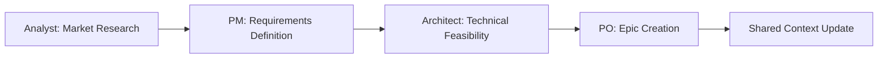
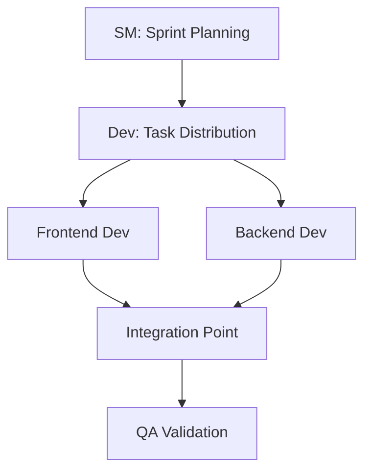
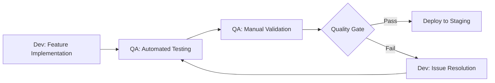

# BMAD Collaboration Best Practices

## Overview
This document outlines the collaboration best practices for BMAD workflow integration, ensuring maximum efficiency, quality, and seamless coordination across multi-agent development teams.

## Foundation Principles

### 1. Unified Context Management
**Principle**: All agents operate within a shared, continuously synchronized development context.

**Implementation**:
- **Single Source of Truth**: All project state maintained in `.bmad-workspace/shared-context/`
- **Real-time Updates**: Context updated within 30 seconds of any significant change
- **Atomic Operations**: Context changes committed as atomic transactions
- **Version Control**: All context changes tracked with agent attribution

**Best Practices**:
```javascript
// Always update context before major operations
await updateSharedContext({
  agent: 'dev-frontend',
  operation: 'component-creation',
  files: ['src/components/AuthModal.tsx'],
  status: 'in-progress',
  blockers: [],
  nextSteps: ['implement-validation', 'add-tests']
});
```

### 2. Structured Agent Communication
**Principle**: All inter-agent communication follows standardized protocols for clarity and traceability.

**Communication Hierarchy**:
1. **Direct Handoff**: Agent-to-agent task transfer with full context
2. **Orchestrator Mediated**: Complex coordination through bmad-orchestrator
3. **Broadcast Updates**: Status updates to all relevant agents
4. **Emergency Escalation**: Critical issue escalation with immediate notification

**Message Structure**:
```json
{
  "timestamp": "2024-01-15T10:30:00Z",
  "from": "pm",
  "to": "architect",
  "type": "handoff|update|request|escalation",
  "priority": "low|medium|high|critical",
  "context": {
    "task": "user-authentication-system",
    "phase": "technical-design",
    "requirements": ["multi-factor", "social-login", "security-compliance"],
    "constraints": ["budget", "timeline", "existing-infrastructure"]
  },
  "artifacts": ["requirements.md", "user-stories.md"],
  "expectations": {
    "deliverables": ["technical-spec", "architecture-diagram"],
    "timeline": "2024-01-15T16:00:00Z",
    "quality-gates": ["security-review", "scalability-assessment"]
  }
}
```

### 3. Quality Gates Integration
**Principle**: Every agent handoff includes mandatory quality validation to ensure work meets standards.

**Quality Gate Types**:
- **Security Gate**: All artifacts pass security validation
- **Specification Gate**: Work aligns with documented requirements
- **Test Gate**: Comprehensive test coverage and passing tests
- **Documentation Gate**: Adequate documentation for next phase
- **Integration Gate**: Compatible with existing system components

**Implementation Example**:
```bash
# Pre-handoff quality gate execution
node scripts/quality-gate-check.js \
  --phase development-to-qa \
  --artifacts src/components/ tests/ \
  --requirements requirements.md \
  --security-level high \
  --coverage-threshold 90
```

## Phase-Specific Collaboration Patterns

### Planning Phase Collaboration

#### Analyst → PM → Architect → PO Flow


**Best Practices**:
- **Research Handoff**: Analyst provides market insights, competitive analysis, and user needs
- **Requirements Translation**: PM converts research into actionable product requirements
- **Technical Validation**: Architect assesses feasibility and provides technical constraints
- **Epic Structuring**: PO creates well-defined epics with clear acceptance criteria

**Collaboration Example**:
```javascript
// Analyst completes research phase
const researchResults = await analyst.completeMarketResearch({
  competitors: ['CompetitorA', 'CompetitorB'],
  userNeeds: ['security', 'usability', 'performance'],
  marketGaps: ['mobile-first-auth', 'enterprise-sso']
});

// Handoff to PM with structured data
await handoffToAgent('pm', {
  artifacts: researchResults,
  recommendations: ['focus-on-mobile', 'enterprise-market-opportunity'],
  constraints: ['6-month-timeline', 'limited-budget']
});
```

### Development Phase Collaboration

#### Parallel Development Coordination


**Best Practices**:
- **Work Decomposition**: SM breaks epics into manageable development tasks
- **Dependency Management**: Clear identification and coordination of cross-team dependencies
- **Integration Planning**: Early identification of integration points and contracts
- **Continuous Sync**: Daily synchronization of progress and blockers

**Parallel Work Coordination**:
```javascript
// Sprint Master coordinates parallel development
const sprintPlan = await sm.createSprintPlan({
  epic: 'user-authentication',
  developers: ['dev-frontend', 'dev-backend'],
  integration_points: [
    {
      component: 'auth-api',
      dependencies: ['frontend-forms', 'backend-validation'],
      contract: 'api-specification.yaml'
    }
  ]
});

// Distribute work with clear interfaces
await Promise.all([
  assignTask('dev-frontend', sprintPlan.frontend_tasks),
  assignTask('dev-backend', sprintPlan.backend_tasks)
]);
```

### Quality Assurance Integration

#### Development-QA Continuous Loop


**Best Practices**:
- **Shift-Left Testing**: QA involved from planning phase for test strategy
- **Automated First**: Comprehensive automated testing before manual validation
- **Continuous Feedback**: Real-time feedback loop between development and QA
- **Quality Metrics**: Quantitative quality assessment with defined thresholds

## Advanced Collaboration Patterns

### Cross-Functional Team Integration

#### Feature Team Approach
```javascript
const featureTeam = {
  lead: 'pm',
  members: ['analyst', 'architect', 'dev-frontend', 'dev-backend', 'qa', 'ux-expert'],
  communication: 'daily-sync',
  sharedContext: '.bmad-workspace/feature-teams/auth-system/',
  qualityGates: ['security', 'performance', 'usability', 'maintainability']
};

// Feature team daily coordination
await featureTeam.dailySync({
  progress: getAgentProgress(featureTeam.members),
  blockers: identifyBlockers(featureTeam.members),
  dependencies: analyzeDependencies(),
  risks: assessRisks(),
  nextSteps: planNextSteps()
});
```

#### Expertise Sharing Protocol
```javascript
// Cross-agent knowledge sharing
const expertiseSharing = {
  'security-best-practices': {
    expert: 'architect',
    consumers: ['dev-frontend', 'dev-backend', 'qa'],
    format: 'workshop',
    schedule: 'weekly'
  },
  'user-experience-patterns': {
    expert: 'ux-expert',
    consumers: ['dev-frontend', 'pm', 'qa'],
    format: 'design-review',
    schedule: 'per-feature'
  }
};
```

### Conflict Resolution Mechanisms

#### Automated Conflict Detection
```javascript
class ConflictDetector {
  detectConflicts(agentOperations) {
    const conflicts = [];
    
    // File access conflicts
    const fileConflicts = this.detectFileConflicts(agentOperations);
    
    // Resource contention
    const resourceConflicts = this.detectResourceConflicts(agentOperations);
    
    // Specification misalignment
    const specConflicts = this.detectSpecificationConflicts(agentOperations);
    
    return [...fileConflicts, ...resourceConflicts, ...specConflicts];
  }
  
  resolveConflict(conflict) {
    switch (conflict.type) {
      case 'file_access':
        return this.resolveMergeConflict(conflict);
      case 'resource_contention':
        return this.allocateResources(conflict);
      case 'specification_mismatch':
        return this.escalateToArchitect(conflict);
    }
  }
}
```

#### Escalation Matrix
```javascript
const escalationMatrix = {
  'technical-decisions': {
    level1: 'peer-review',
    level2: 'architect-review',
    level3: 'team-discussion',
    level4: 'external-consultation'
  },
  'timeline-conflicts': {
    level1: 'task-reprioritization',
    level2: 'sm-coordination',
    level3: 'pm-negotiation',
    level4: 'stakeholder-escalation'
  },
  'quality-standards': {
    level1: 'automated-fixing',
    level2: 'peer-assistance',
    level3: 'qa-intervention',
    level4: 'process-review'
  }
};
```

## Performance Optimization Strategies

### Efficient Handoff Protocols

#### Optimal Handoff Structure
```javascript
class OptimalHandoff {
  async executeHandoff(fromAgent, toAgent, task, context) {
    // Pre-handoff validation
    await this.validateReadiness(fromAgent, task);
    
    // Context preparation
    const handoffPackage = await this.prepareHandoffPackage({
      task,
      context,
      artifacts: this.gatherArtifacts(task),
      quality_report: this.generateQualityReport(task),
      next_steps: this.identifyNextSteps(task)
    });
    
    // Atomic handoff execution
    await this.atomicHandoff(fromAgent, toAgent, handoffPackage);
    
    // Post-handoff verification
    await this.verifyHandoffSuccess(toAgent, task);
    
    // Update metrics
    this.recordHandoffMetrics(fromAgent, toAgent, Date.now() - startTime);
  }
}
```

#### Batch Operations
```javascript
// Batch multiple operations to reduce overhead
const batchOperations = {
  context_updates: [],
  file_operations: [],
  notifications: [],
  
  async executeBatch() {
    await Promise.all([
      this.updateContextBatch(this.context_updates),
      this.executeFileBatch(this.file_operations),
      this.sendNotificationBatch(this.notifications)
    ]);
    
    this.clearBatches();
  }
};
```

### Resource Management

#### Dynamic Resource Allocation
```javascript
class ResourceManager {
  allocateResources(agents, workload) {
    const allocation = {};
    
    // CPU allocation based on task complexity
    const cpuRequirements = this.calculateCPURequirements(workload);
    
    // Memory allocation for context management
    const memoryRequirements = this.calculateMemoryRequirements(agents);
    
    // I/O allocation for file operations
    const ioRequirements = this.calculateIORequirements(workload);
    
    return this.optimizeAllocation({
      cpu: cpuRequirements,
      memory: memoryRequirements,
      io: ioRequirements
    });
  }
}
```

## Monitoring and Continuous Improvement

### Real-time Collaboration Monitoring
```javascript
class CollaborationMonitor {
  constructor() {
    this.metrics = new BMADPerformanceTracker();
    this.realTimeAnalyzer = new RealTimeAnalyzer();
  }
  
  async monitorCollaboration() {
    const collaborationData = await this.gatherCollaborationData();
    
    // Analyze patterns
    const patterns = this.realTimeAnalyzer.analyzePatterns(collaborationData);
    
    // Identify improvements
    const improvements = this.identifyImprovements(patterns);
    
    // Apply optimizations
    await this.applyOptimizations(improvements);
    
    // Update best practices
    this.updateBestPractices(patterns);
  }
}
```

### Feedback Loops
```javascript
const feedbackLoops = {
  // Daily retrospective
  daily: async () => {
    const dailyMetrics = await performanceTracker.getDailyMetrics();
    const improvements = analyzeDailyPerformance(dailyMetrics);
    await applyImmediateImprovements(improvements);
  },
  
  // Weekly optimization
  weekly: async () => {
    const weeklyTrends = await performanceTracker.getWeeklyTrends();
    const optimizations = identifyWeeklyOptimizations(weeklyTrends);
    await scheduleOptimizations(optimizations);
  },
  
  // Monthly strategy review
  monthly: async () => {
    const monthlyAnalysis = await performanceTracker.getMonthlyAnalysis();
    const strategicChanges = identifyStrategicChanges(monthlyAnalysis);
    await planStrategicImplementation(strategicChanges);
  }
};
```

## Security and Compliance

### Secure Collaboration Protocols
```javascript
const securityProtocols = {
  // Agent authentication
  authentication: {
    method: 'token-based',
    rotation: 'daily',
    validation: 'cryptographic'
  },
  
  // Secure communication
  communication: {
    encryption: 'AES-256',
    integrity: 'HMAC-SHA256',
    authentication: 'mutual-TLS'
  },
  
  // Access control
  access_control: {
    model: 'RBAC',
    principle: 'least-privilege',
    audit: 'comprehensive'
  }
};
```

### Compliance Monitoring
```javascript
class ComplianceMonitor {
  async validateCompliance() {
    const compliance = {
      security: await this.validateSecurityCompliance(),
      quality: await this.validateQualityCompliance(),
      process: await this.validateProcessCompliance(),
      documentation: await this.validateDocumentationCompliance()
    };
    
    return this.generateComplianceReport(compliance);
  }
}
```

## Integration with Development Protocols

### Security-First Integration
- **Threat Modeling**: Every collaboration pattern includes threat assessment
- **Security Reviews**: Mandatory security validation at each handoff
- **Compliance Tracking**: Real-time compliance monitoring across all agents
- **Incident Response**: Coordinated incident response with agent specialization

### TDD Integration
- **Test-First Handoffs**: Next agent receives failing tests from previous agent
- **Specification Alignment**: All agents work from shared, validated specifications
- **Quality Gates**: Test coverage and passing requirements at each phase
- **Continuous Validation**: Real-time validation of TDD compliance

### Surgical Debugging Integration
- **Minimal Impact**: Collaboration patterns designed for surgical precision
- **Context Preservation**: Debugging maintains full collaboration context
- **Escalation Protocols**: Systematic escalation when debugging exceeds agent capabilities
- **Knowledge Sharing**: Debugging insights shared across agent network

## Best Practice Summary

### Core Collaboration Principles
1. **Shared Context First**: Always prioritize shared context consistency
2. **Quality Gates**: Never bypass quality validation for speed
3. **Clear Communication**: Use structured, traceable communication
4. **Continuous Monitoring**: Real-time performance and health monitoring
5. **Iterative Improvement**: Regular optimization based on performance data

### Agent Coordination Excellence
1. **Handoff Atomicity**: All handoffs are atomic and verifiable
2. **Conflict Prevention**: Proactive conflict detection and resolution
3. **Resource Optimization**: Dynamic resource allocation based on workload
4. **Security Integration**: Security considerations in all collaboration patterns
5. **Performance Tracking**: Comprehensive metrics collection and analysis

### Team Success Factors
1. **Unified Goals**: All agents aligned to common objectives
2. **Complementary Skills**: Leverage each agent's specialization effectively
3. **Continuous Learning**: Agents improve through collaboration experience
4. **Adaptive Processes**: Processes evolve based on performance feedback
5. **Excellence Culture**: Commitment to continuous improvement and quality

This best practices framework ensures BMAD agents collaborate effectively while maintaining the highest standards of security, quality, and performance. Regular review and updates ensure the framework evolves with team needs and technological advancement.