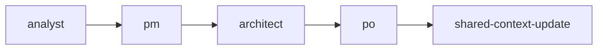
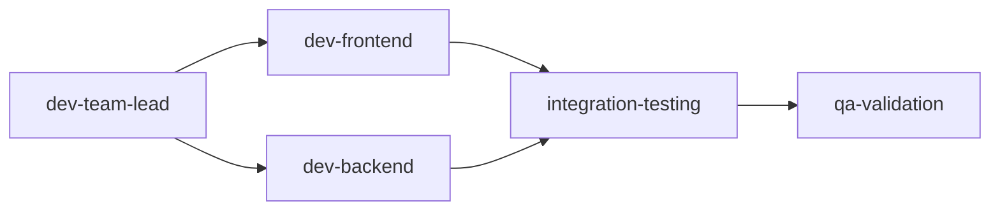
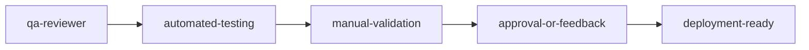

# BMAD Shared Workspace Guidelines

## Overview
This document defines the shared workspace structure and protocols for multi-agent BMAD collaboration, ensuring all agents work efficiently within a unified development environment.

## Shared Workspace Structure

### Core Directory Layout
```
project-root/
├── .bmad-workspace/          # Shared agent workspace
│   ├── agent-status/         # Real-time agent status tracking
│   ├── shared-context/       # Cross-agent context files
│   ├── coordination-logs/    # Agent coordination and handoff logs
│   ├── work-queues/         # Task queues for agent coordination
│   └── artifacts/           # Shared artifacts and outputs
├── .bmad-core/              # BMAD framework files
├── docs/                    # Project documentation
├── src/                     # Source code
└── tests/                   # Test files
```

## Agent Workspace Protocols

### 1. File System Access Rules
- **Read Access**: All agents can read any project file
- **Write Access**: Agents must coordinate writes to avoid conflicts
- **Shared Files**: Use `.bmad-workspace/shared-context/` for cross-agent data
- **Agent-Specific**: Use `.bmad-workspace/agent-status/[agent-name]/` for individual state

### 2. Context Sharing Standards
```json
{
  "contextFile": ".bmad-workspace/shared-context/current-context.json",
  "structure": {
    "activeTask": "Current development task",
    "lastAgent": "Last agent to update context",
    "status": "current|blocked|completed",
    "artifacts": ["list of created files"],
    "blockers": ["any blocking issues"],
    "nextSteps": ["recommended next actions"]
  }
}
```

### 3. Coordination Protocols

#### Agent Status Updates
```bash
# Update agent status
echo "{\"agent\":\"dev\",\"status\":\"active\",\"task\":\"implementing-auth\",\"timestamp\":\"$(date -Iseconds)\"}" > .bmad-workspace/agent-status/dev-status.json
```

#### Handoff Procedures
1. **Pre-handoff**: Update shared context with current state
2. **Signal handoff**: Create handoff notification in coordination logs
3. **Post-handoff**: Next agent acknowledges receipt and begins work
4. **Status update**: Update agent status to reflect new ownership

### 4. Work Queue Management

#### Queue Structure
```
.bmad-workspace/work-queues/
├── planning-queue.json      # Tasks for planning phase agents
├── development-queue.json   # Tasks for development agents
├── qa-queue.json           # Tasks for QA agents
└── completed-queue.json    # Completed tasks archive
```

#### Queue Operations
- **Add Task**: Append to appropriate queue with priority and dependencies
- **Claim Task**: Move from queue to agent-specific active tasks
- **Complete Task**: Move to completed queue with results
- **Block Task**: Mark as blocked with reason and requirements for resolution

## Communication Standards

### 1. Status Communication
- **Real-time status**: Updated every 5 minutes during active work
- **Milestone updates**: Immediate notification of major completions
- **Blocker alerts**: Immediate escalation of blocking issues
- **Handoff notifications**: Clear agent-to-agent transition messages

### 2. Logging Protocols
```javascript
// Standard log entry format
const logEntry = {
  timestamp: new Date().toISOString(),
  agent: 'agent-name',
  level: 'info|warn|error',
  message: 'Human-readable message',
  context: {
    task: 'current-task-id',
    phase: 'planning|development|qa',
    artifacts: ['modified-files'],
    metrics: {
      duration: 'task-duration-ms',
      complexity: 'low|medium|high'
    }
  }
};
```

### 3. Artifact Management
- **Naming Convention**: `[agent]-[task-type]-[timestamp].[ext]`
- **Version Control**: All artifacts committed with descriptive messages
- **Documentation**: Self-documenting artifacts with inline comments
- **Validation**: Automated validation of artifact quality and completeness

## Collaboration Workflows

### 1. Multi-Agent Planning Session


### 2. Development Coordination


### 3. Quality Assurance Flow


## Performance Guidelines

### 1. Resource Management
- **CPU Usage**: Agents should monitor and limit CPU usage during coordination
- **Memory Usage**: Shared context files should remain under 10MB
- **Disk I/O**: Batch file operations to reduce I/O overhead
- **Network**: Minimize external API calls during coordination phases

### 2. Timing Standards
- **Response Time**: Agents must respond to handoffs within 30 seconds
- **Status Updates**: Maximum 5-minute intervals for status updates
- **Queue Processing**: Process queue items within defined SLA per task type
- **Timeout Handling**: Escalate to orchestrator if agent doesn't respond within 2 minutes

### 3. Scalability Considerations
- **Agent Limits**: Maximum 5 concurrent agents per project
- **Queue Depth**: Maximum 20 items per work queue
- **Context Size**: Shared context should not exceed 100KB
- **Log Rotation**: Rotate coordination logs daily, keep 7 days

## Error Handling and Recovery

### 1. Common Failure Scenarios
- **Agent Timeout**: Automatic escalation to orchestrator
- **Context Corruption**: Rollback to last known good state
- **File Conflicts**: Merge conflict resolution protocols
- **Queue Deadlock**: Automatic queue reset and task redistribution

### 2. Recovery Procedures
```bash
# Emergency workspace reset
cp -r .bmad-workspace .bmad-workspace-backup-$(date +%s)
rm -rf .bmad-workspace/agent-status/*
echo "{\"status\":\"reset\",\"timestamp\":\"$(date -Iseconds)\"}" > .bmad-workspace/emergency-reset.json
```

### 3. Escalation Matrix
1. **Level 1**: Automatic retry (agent handles internally)
2. **Level 2**: Peer agent assistance (horizontal escalation)
3. **Level 3**: Orchestrator intervention (vertical escalation)
4. **Level 4**: Human developer intervention (manual resolution)

## Security and Access Control

### 1. File Permissions
- **Workspace Files**: Read/write for all BMAD agents
- **Source Code**: Standard project permissions apply
- **Sensitive Data**: Never store credentials in shared workspace
- **Logs**: Sanitize all sensitive information from coordination logs

### 2. Agent Authentication
- **Agent Identity**: Each agent must identify itself in all operations
- **Operation Logging**: All file modifications logged with agent identity
- **Access Auditing**: Regular audits of agent file access patterns
- **Permission Validation**: Validate agent permissions before file operations

## Monitoring and Metrics

### 1. Workspace Health Metrics
- **Agent Response Time**: Average time for agents to respond to handoffs
- **Context Freshness**: Age of shared context information
- **Queue Efficiency**: Task processing time and queue depth
- **Error Rates**: Frequency of coordination failures and recoveries

### 2. Performance Dashboards
- **Real-time Status**: Live agent status and current tasks
- **Historical Trends**: Agent performance over time
- **Resource Usage**: CPU, memory, and disk usage by agents
- **Collaboration Efficiency**: Success rate of multi-agent workflows

## Best Practices

### 1. Development Guidelines
- **Atomic Operations**: Make file changes in atomic operations
- **Clear Communication**: Use descriptive messages in all coordination
- **Frequent Updates**: Update shared context frequently during long tasks
- **Graceful Degradation**: Design workflows to handle agent failures

### 2. Maintenance Procedures
- **Daily Cleanup**: Archive old logs and clear completed queues
- **Weekly Review**: Analyze performance metrics and identify improvements
- **Monthly Audits**: Review security and access patterns
- **Quarterly Updates**: Update guidelines based on usage patterns

## Integration with Development Protocols

### 1. Security-First Protocol Integration
- **Security Validation**: All shared artifacts must pass security checks
- **Threat Assessment**: Agents must assess security implications of changes
- **Compliance Tracking**: Monitor adherence to security protocols
- **Incident Response**: Coordinate security incident response across agents

### 2. TDD Protocol Integration
- **Test Coordination**: Share test results and coverage across agents
- **Specification Alignment**: Ensure all agents work from same specifications
- **Quality Gates**: Implement quality gates at agent handoff points
- **Continuous Validation**: Validate TDD compliance throughout workflow

### 3. Technical Debt Management
- **Debt Tracking**: Shared tracking of technical debt across agents
- **Authorization**: Coordinate technical debt authorization across teams
- **Remediation Planning**: Collaborative technical debt remediation
- **Impact Assessment**: Cross-agent assessment of debt impact

This workspace guidelines document ensures all BMAD agents work efficiently together while maintaining the highest standards of security, quality, and collaboration.