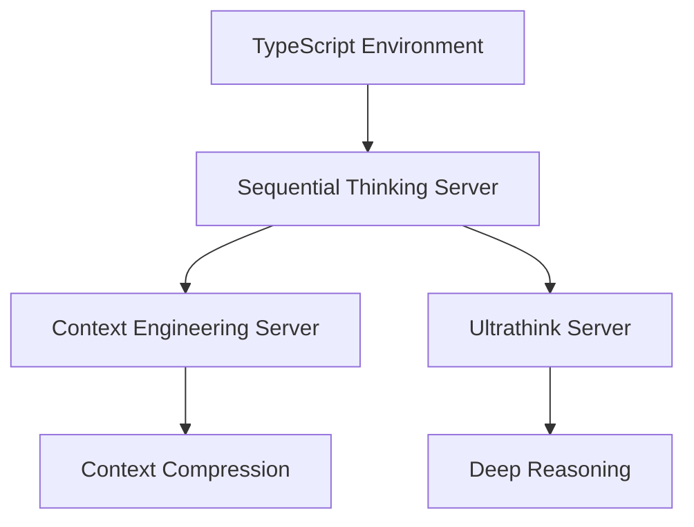

# Dependency Analysis: Context Engineering & Ultrathink Implementation

## Executive Summary

This document provides comprehensive dependency analysis for implementing Context Engineering Patterns and Ultrathink Implementation systems in Phase 5.5. The analysis identifies all dependencies, sequences implementation tasks, and establishes clear integration pathways with existing infrastructure.

## 1. Infrastructure Dependency Mapping

### 1.1 Existing Infrastructure Assessment

#### Available MCP Servers
- ✅ **Memory MCP Server**: Operational with permissions for read_graph, create_entities, create_relations, add_observations
- ✅ **Filesystem MCP Server**: Full CRUD operations available  
- ✅ **GitHub MCP Server**: Repository operations available
- ✅ **BMAD-METHOD MCP Server**: Strategic agent coordination available
- ✅ **Puppeteer Browser MCP Server**: Web automation capabilities

#### Required but Missing MCP Servers (From Phase 5.1)
- ❌ **Task Queue MCP Server**: Needed for agent task coordination and workload management
- ❌ **Load Balancer MCP Server**: Required for intelligent agent distribution and health monitoring
- ❌ **Sequential Thinking MCP Server**: Critical for complex reasoning workflows
- ⚠️ **Enhanced Memory MCP Server**: Current memory server may need extensions for advanced context management

### 1.2 Dependency Classification

#### Critical Dependencies (Must Have)
1. **Memory MCP Server** - For context storage and retrieval
2. **Filesystem MCP Server** - For configuration and logging
3. **TypeScript/Node.js Runtime** - For server implementation
4. **SQLite Database** - For persistent data storage
5. **Encryption Libraries** - For data security

#### Important Dependencies (Should Have)
1. **Sequential Thinking MCP Server** - For advanced reasoning patterns
2. **Task Queue MCP Server** - For workload coordination
3. **Load Balancer MCP Server** - For agent distribution
4. **Monitoring Systems** - For performance tracking

#### Optional Dependencies (Nice to Have)
1. **Vector Database** - For semantic similarity (future enhancement)
2. **Machine Learning Models** - For advanced compression (future enhancement)
3. **Web Dashboard** - For system monitoring (future enhancement)

## 2. Implementation Dependency Sequence

### 2.1 Phase 1: Foundation Infrastructure (Critical Path)

#### Sequential Thinking MCP Server Implementation
**Duration**: 20 minutes | **Dependencies**: None | **Critical**: Yes



**Required Before**:
- Context Engineering advanced features
- Ultrathink reasoning workflows
- Multi-step reasoning validation

**Implementation Tasks**:
1. Create basic sequential thinking server structure (5 min)
2. Implement linear reasoning pattern support (10 min)
3. Add basic branching capability (5 min)
4. Configure Claude Code integration

#### Enhanced Memory MCP Server Extensions
**Duration**: 15 minutes | **Dependencies**: Existing Memory MCP | **Critical**: Yes

**Required Extensions**:
- Context compression storage
- Cross-agent context sharing
- Session persistence
- Context metadata management

**Implementation Tasks**:
1. Assess current memory server capabilities (5 min)
2. Add context compression storage (5 min)
3. Implement cross-agent sharing protocols (5 min)
4. Test integration with existing memory operations

### 2.2 Phase 2: Core System Implementation (Primary Development)

#### Context Engineering MCP Server
**Duration**: 35 minutes | **Dependencies**: Memory MCP, Sequential Thinking MCP | **Critical**: Yes

**Dependency Chain**:
```
Memory MCP Server → Context Storage Foundation
Sequential Thinking MCP → Context Optimization Logic
Filesystem MCP → Configuration Management
```

**Implementation Sequence**:
1. **Context Compression Engine** (20 min)
   - Dependencies: Compression libraries, Memory MCP
   - Deliverable: Statistical compression capability
   
2. **Relevance Scoring System** (15 min)  
   - Dependencies: Context data from Memory MCP
   - Deliverable: Keyword and temporal scoring

#### Ultrathink MCP Server
**Duration**: 40 minutes | **Dependencies**: Sequential Thinking MCP, Memory MCP | **Critical**: Yes

**Dependency Chain**:
```
Sequential Thinking MCP → Reasoning Foundation
Memory MCP → Problem/Solution Storage
Context Engineering MCP → Context for Reasoning
```

**Implementation Sequence**:
1. **Deep Reasoning Engine** (25 min)
   - Dependencies: Sequential Thinking MCP for patterns
   - Deliverable: Linear sequential reasoning with branching
   
2. **Multi-Perspective Analyzer** (15 min)
   - Dependencies: Problem context from Memory MCP
   - Deliverable: Technical, business, security perspectives

### 2.3 Phase 3: Integration and Enhancement (Secondary Features)

#### Cross-System Integration
**Duration**: 20 minutes | **Dependencies**: Both core servers | **Critical**: Medium

**Integration Points**:
- Context sharing between reasoning and compression
- Solution evaluation using context relevance
- Cross-agent communication protocols
- Performance monitoring integration

**Implementation Tasks**:
1. Configure context flow between servers (10 min)
2. Implement solution evaluation integration (5 min)
3. Set up performance monitoring (5 min)

## 3. Detailed Dependency Specifications

### 3.1 Technology Dependencies

#### Runtime Dependencies
```json
{
  "node": ">=18.0.0",
  "typescript": "^5.0.0",
  "@types/node": "^20.0.0",
  "sqlite3": "^5.1.0",
  "crypto": "built-in",
  "zlib": "built-in"
}
```

#### MCP Framework Dependencies
```json
{
  "@modelcontextprotocol/sdk": "latest",
  "@types/sqlite3": "^3.1.0",
  "compression": "^1.7.0",
  "validator": "^13.0.0"
}
```

#### Security Dependencies
```json
{
  "bcrypt": "^5.1.0",
  "jsonwebtoken": "^9.0.0",
  "helmet": "^7.0.0",
  "express-rate-limit": "^6.0.0"
}
```

### 3.2 Data Dependencies

#### Database Schema Requirements
```sql
-- Context Engineering Tables
CREATE TABLE contexts (
    id TEXT PRIMARY KEY,
    content TEXT NOT NULL,
    metadata JSON,
    relevance_score REAL,
    created_at TIMESTAMP,
    compressed_data BLOB
);

CREATE TABLE reasoning_sessions (
    session_id TEXT PRIMARY KEY,
    problem_id TEXT,
    reasoning_chain JSON,
    status TEXT,
    created_at TIMESTAMP
);

CREATE TABLE solutions (
    solution_id TEXT PRIMARY KEY,
    problem_id TEXT,
    description TEXT,
    evaluation JSON,
    ranking INTEGER
);
```

#### Configuration Dependencies
```yaml
# Context Engineering Configuration
context_config:
  compression:
    default_ratio: 0.7
    max_context_size: 10485760  # 10MB
    cache_duration: 3600  # 1 hour
  
  relevance:
    scoring_algorithm: "keyword_temporal"
    cache_enabled: true
    batch_size: 100

# Ultrathink Configuration  
ultrathink_config:
  reasoning:
    max_depth: 10
    timeout_ms: 30000
    patterns: ["linear", "branching"]
  
  perspectives:
    enabled: ["technical", "business", "security"]
    weights: {"technical": 0.4, "business": 0.4, "security": 0.2}
```

## 4. Critical Path Analysis

### 4.1 Critical Path Identification

```mermaid
gantt
    title Context Engineering & Ultrathink Implementation Critical Path
    dateFormat  X
    axisFormat %s

    section Foundation
    Sequential Thinking MCP    :crit, seq, 0, 20
    Memory MCP Extensions      :crit, mem, 5, 20

    section Core Implementation
    Context Compression        :crit, comp, after seq, 20
    Relevance Scoring         :rele, after mem, 15
    Deep Reasoning Engine     :crit, reas, after seq, 25
    Multi-Perspective Analysis :pers, after comp, 15

    section Integration
    Cross-System Integration  :inte, after reas, 20
    Testing & Validation      :test, after inte, 10
```



**Critical Path Duration**: 75 minutes
**Total Project Duration**: 95 minutes (including parallel tasks)

### 4.2 Dependency Risks and Mitigation

#### High-Risk Dependencies
1. **Sequential Thinking MCP Server**
   - **Risk**: Complex reasoning logic may exceed time estimates
   - **Mitigation**: Implement minimal linear reasoning first, defer advanced patterns
   - **Fallback**: Use existing memory MCP for basic reasoning storage

2. **Memory MCP Server Extensions**
   - **Risk**: Current server may not support required extensions
   - **Mitigation**: Assess capabilities first, implement workarounds if needed
   - **Fallback**: Use filesystem storage for context data temporarily

#### Medium-Risk Dependencies
1. **Context Compression Integration**
   - **Risk**: Performance issues with large context data
   - **Mitigation**: Implement size limits and streaming compression
   - **Fallback**: Disable compression temporarily, use raw context storage

2. **Cross-Agent Communication**
   - **Risk**: Agent coordination complexity may impact timeline
   - **Mitigation**: Implement basic sharing first, defer advanced coordination
   - **Fallback**: Manual agent coordination through filesystem sharing

## 5. Integration Specifications

### 5.1 MCP Server Integration Points

#### Context Engineering → Memory MCP
```typescript
interface ContextMemoryIntegration {
  storeCompressedContext(contextId: string, compressed: CompressedContext): Promise<void>;
  retrieveContext(contextId: string): Promise<ContextData>;
  shareContextBetweenAgents(fromAgent: string, toAgent: string, contextId: string): Promise<void>;
  queryRelevantContexts(query: string, limit: number): Promise<ContextData[]>;
}
```

#### Ultrathink → Sequential Thinking MCP
```typescript
interface UltrathinkSequentialIntegration {
  startReasoningSession(problem: Problem, pattern: ReasoningPattern): Promise<SessionId>;
  addReasoningStep(sessionId: SessionId, step: ReasoningStep): Promise<void>;
  branchReasoningPath(sessionId: SessionId, branchPoint: ThoughtId): Promise<BranchId>;
  validateReasoningChain(sessionId: SessionId): Promise<ValidationResult>;
}
```

#### Cross-System Integration
```typescript
interface CrossSystemIntegration {
  // Context Engineering feeds Ultrathink
  getRelevantContextForReasoning(problemId: string): Promise<ContextData[]>;
  
  // Ultrathink informs Context Engineering
  updateContextRelevance(contextId: string, reasoningResult: ReasoningResult): Promise<void>;
  
  // Shared performance monitoring
  reportSystemMetrics(serverType: ServerType, metrics: PerformanceMetrics): Promise<void>;
}
```

### 5.2 Agent Coordination Dependencies

#### BMAD Framework Integration
- **Analyst Agent**: Provides problem context for reasoning
- **Architect Agent**: Reviews technical perspective analysis
- **PM Agent**: Evaluates business perspective results
- **QA Agent**: Validates reasoning and context quality

#### Custom Agent Integration
- **Security Specialist**: Validates security perspective analysis
- **Spec Developer**: Integrates context and reasoning into implementations
- **Spec Tester**: Tests context compression and reasoning validation

## 6. Deployment Dependencies

### 6.1 Environment Requirements

#### Development Environment
```yaml
development:
  node_version: ">=18.0.0"
  npm_version: ">=9.0.0"
  sqlite3: "available"
  typescript: "global installation"
  claude_code: "integrated MCP support"
```

#### Production Environment
```yaml
production:
  runtime: "Node.js 18+ LTS"
  database: "SQLite with encryption"
  monitoring: "Performance metrics enabled"
  security: "All security controls active"
  backup: "Automated backup procedures"
```

### 6.2 Configuration Dependencies

#### Claude Code MCP Registration
```json
{
  "mcpServers": {
    "context-engineering": {
      "command": "node",
      "args": ["./context-engineering-server.js"],
      "cwd": "./mcp-servers/context-engineering"
    },
    "ultrathink": {
      "command": "node", 
      "args": ["./ultrathink-server.js"],
      "cwd": "./mcp-servers/ultrathink"
    },
    "sequential-thinking": {
      "command": "node",
      "args": ["./sequential-thinking-server.js"], 
      "cwd": "./mcp-servers/sequential-thinking"
    }
  }
}
```

## 7. Validation and Testing Dependencies

### 7.1 Test Infrastructure Requirements

#### Unit Testing Dependencies
- Jest or Vitest for test framework
- Mock MCP server instances for isolated testing
- Test data fixtures for context and reasoning scenarios
- Performance benchmarking tools

#### Integration Testing Dependencies
- Full MCP server stack deployment
- Agent simulation framework for multi-agent testing
- Load testing tools for performance validation
- Security testing tools for vulnerability assessment

### 7.2 Success Criteria Dependencies

#### Context Engineering Validation
- ✅ Compression ratio ≥60% with ≥95% semantic accuracy
- ✅ Relevance scoring correlation ≥85% with manual evaluation
- ✅ Cross-agent sharing consistency ≥99%
- ✅ Performance within specified thresholds

#### Ultrathink Validation
- ✅ Linear reasoning success rate ≥80% for test problems
- ✅ Multi-perspective analysis coverage ≥95%
- ✅ Solution ranking accuracy ≥90% vs expert evaluation
- ✅ Reasoning validation catches ≥95% of logical inconsistencies

## 8. Implementation Roadmap

### 8.1 Dependency-Driven Implementation Sequence

**Phase 1 (20 minutes): Foundation Infrastructure**
1. Sequential Thinking MCP Server (basic linear reasoning)
2. Memory MCP Server extensions assessment and enhancement

**Phase 2 (55 minutes): Core Implementation**
1. Context Engineering MCP Server
   - Context compression engine (with simplified algorithm per debt decision)
   - Relevance scoring system (keyword/temporal only per debt decision)
2. Ultrathink MCP Server
   - Deep reasoning engine (linear focus per debt decision)
   - Multi-perspective analyzer (manual configuration per debt decision)

**Phase 3 (20 minutes): Integration and Validation**
1. Cross-system integration implementation
2. Claude Code MCP registration and testing
3. Performance validation and monitoring setup

### 8.2 Dependency Validation Checkpoints

**Checkpoint 1 (After Phase 1)**: Foundation infrastructure operational
- Sequential Thinking MCP server responding to basic requests
- Memory MCP server supporting context operations
- Claude Code integration functional

**Checkpoint 2 (After Phase 2)**: Core systems operational  
- Context Engineering providing compression and relevance scoring
- Ultrathink providing linear reasoning and perspective analysis
- Both servers integrated with foundation infrastructure

**Checkpoint 3 (After Phase 3)**: Full system integration
- Cross-system communication working
- All MCP servers registered and accessible through Claude Code
- Performance monitoring active and reporting metrics

## 9. Risk Assessment and Contingency Planning

### 9.1 High-Priority Dependency Risks

**Risk 1: Sequential Thinking MCP Server Complexity**
- **Probability**: Medium
- **Impact**: High (blocks Ultrathink implementation)
- **Mitigation**: Implement minimal linear reasoning first
- **Contingency**: Use Memory MCP for reasoning storage temporarily

**Risk 2: Memory MCP Extensions Compatibility**
- **Probability**: Low
- **Impact**: Medium (affects context sharing)
- **Mitigation**: Assess current capabilities thoroughly before extension
- **Contingency**: Implement file-based context sharing

**Risk 3: Performance Integration Issues**
- **Probability**: Medium  
- **Impact**: Low (affects user experience but not functionality)
- **Mitigation**: Implement performance monitoring early
- **Contingency**: Optimize individual components independently

### 9.2 Contingency Implementation Plans

**Scenario 1: Sequential Thinking Server Delayed**
- Implement Context Engineering without advanced reasoning integration
- Use basic reasoning storage through Memory MCP
- Defer Ultrathink advanced features to future phase

**Scenario 2: Memory MCP Extensions Blocked**
- Implement local file-based storage for context data
- Use SQLite directly for cross-agent context sharing
- Migrate to Memory MCP integration in future update

**Scenario 3: Integration Performance Issues**
- Implement systems independently with minimal integration
- Use async communication for non-critical integrations
- Optimize integration points in subsequent iterations

## 10. Conclusion

The dependency analysis reveals a manageable implementation path with clear critical dependencies and well-defined mitigation strategies. The 95-minute implementation timeline is achievable with proper attention to the critical path through Sequential Thinking MCP Server and core system implementation.

**Key Success Factors:**
1. **Foundation First**: Ensure Sequential Thinking and Memory MCP capabilities before core implementation
2. **Incremental Integration**: Build systems independently, then integrate progressively
3. **Risk Management**: Active monitoring of high-risk dependencies with ready contingencies
4. **Quality Gates**: Validation checkpoints at each phase to ensure integration success

**Next Step**: Proceed to Task Decomposition phase with dependency sequence incorporated into 15-30 minute micro-tasks.