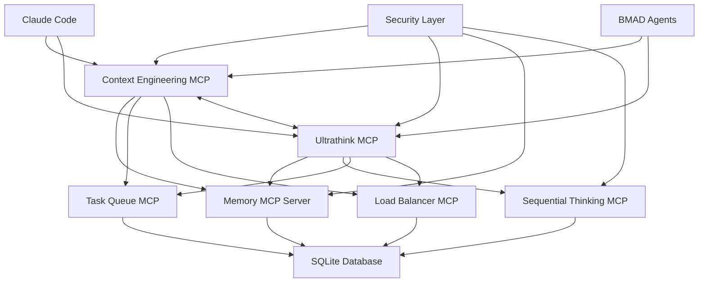

# Design Document: Context Engineering Patterns & Ultrathink Implementation

## Design Overview

This document provides the technical architecture and design for implementing Context Engineering Patterns and Ultrathink Implementation systems. The design follows a modular, security-first approach with seamless integration into the existing MCP server ecosystem.

## 1. System Architecture

### 1.1 High-Level Architecture

```
┌─────────────────────────────────────────────────────────────────────┐
│                        Claude Code Integration Layer                 │
├─────────────────────────────────────────────────────────────────────┤
│  Context Engineering MCP Server    │    Ultrathink MCP Server        │
│  ┌─────────────────────────────┐    │    ┌─────────────────────────┐ │
│  │ Context Compression         │    │    │ Deep Reasoning Engine   │ │
│  │ Relevance Scoring          │    │    │ Problem Solving Workflows │ │
│  │ Optimization Workflows     │    │    │ Reasoning Validation    │ │
│  │ Cross-Agent Sharing        │    │    │ Multi-Perspective Analysis│ │
│  └─────────────────────────────┘    │    │ Solution Evaluation     │ │
├─────────────────────────────────────────────────────────────────────┤
│                    Shared Infrastructure Layer                       │
│  ┌─────────────┐  ┌─────────────┐  ┌─────────────┐  ┌─────────────┐ │
│  │   Memory    │  │ Sequential  │  │ Task Queue  │  │Load Balancer│ │
│  │MCP Server   │  │ Thinking    │  │MCP Server   │  │ MCP Server  │ │
│  │             │  │MCP Server   │  │             │  │             │ │
│  └─────────────┘  └─────────────┘  └─────────────┘  └─────────────┘ │
├─────────────────────────────────────────────────────────────────────┤
│                      Data Persistence Layer                         │
│  ┌─────────────────────────────────────────────────────────────────┐ │
│  │         SQLite Database + Encrypted File Storage               │ │
│  │  Context Data │ Reasoning Chains │ Configuration │ Audit Logs  │ │
│  └─────────────────────────────────────────────────────────────────┘ │
└─────────────────────────────────────────────────────────────────────┘
```

### 1.2 Component Interactions



## 2. Context Engineering MCP Server Design

### 2.1 Server Architecture

```typescript
// Context Engineering MCP Server Structure
export class ContextEngineeringServer {
  private compressionEngine: ContextCompressionEngine;
  private relevanceScorer: RelevanceScorer;
  private optimizationWorkflows: OptimizationWorkflows;
  private sharingManager: CrossAgentSharingManager;
  private securityService: ContextSecurityService;
  private performanceMonitor: PerformanceMonitor;
}
```

### 2.2 Core Components

#### 2.2.1 Context Compression Engine

```typescript
interface ContextCompressionEngine {
  // Compression strategies
  compressStatistical(context: ContextData, ratio: number): Promise<CompressedContext>;
  compressSemantic(context: ContextData, similarityThreshold: number): Promise<CompressedContext>;
  compressHierarchical(context: ContextData, levels: number): Promise<CompressedContext>;
  
  // Decompression and validation
  decompress(compressed: CompressedContext): Promise<ContextData>;
  validateIntegrity(compressed: CompressedContext): Promise<ValidationResult>;
  
  // Quality metrics
  calculateCompressionQuality(original: ContextData, compressed: CompressedContext): Promise<QualityMetrics>;
}

interface CompressedContext {
  id: string;
  originalSize: number;
  compressedSize: number;
  compressionRatio: number;
  strategy: CompressionStrategy;
  timestamp: Date;
  integrityHash: string;
  encryptedData: Buffer;
  metadata: CompressionMetadata;
}
```

#### 2.2.2 Relevance Scoring System

```typescript
interface RelevanceScorer {
  // Scoring algorithms
  scoreKeywordBased(context: ContextElement[], keywords: string[]): Promise<ScoredContext[]>;
  scoreSemanticSimilarity(context: ContextElement[], reference: string): Promise<ScoredContext[]>;
  scoreTemporalRelevance(context: ContextElement[], timeWindow: TimeWindow): Promise<ScoredContext[]>;
  
  // Multi-criteria scoring
  scoreMultiCriteria(context: ContextElement[], criteria: ScoringCriteria): Promise<ScoredContext[]>;
  
  // Score analytics
  generateScoringReport(scores: ScoredContext[]): Promise<ScoringReport>;
  analyzeScoringTrends(historicalScores: ScoredContext[]): Promise<TrendAnalysis>;
}

interface ScoredContext {
  element: ContextElement;
  relevanceScore: number; // 0-100
  confidenceLevel: number; // 0-1
  scoringFactors: ScoringFactor[];
  timestamp: Date;
  scorer: string;
}
```

#### 2.2.3 Cross-Agent Sharing Manager

```typescript
interface CrossAgentSharingManager {
  // Context sharing
  shareContext(fromAgent: AgentId, toAgent: AgentId, context: ContextData): Promise<ShareResult>;
  shareContextBroadcast(fromAgent: AgentId, targetAgents: AgentId[], context: ContextData): Promise<ShareResult[]>;
  
  // Context synchronization
  synchronizeContext(agentId: AgentId): Promise<SynchronizationResult>;
  resolveContextConflicts(conflicts: ContextConflict[]): Promise<ResolutionResult>;
  
  // Access control
  checkSharingPermissions(fromAgent: AgentId, toAgent: AgentId, contextType: ContextType): Promise<boolean>;
  manageAccessControl(agentId: AgentId, permissions: SharingPermissions): Promise<void>;
}

interface ShareResult {
  shareId: string;
  fromAgent: AgentId;
  toAgent: AgentId;
  contextSize: number;
  shareTimestamp: Date;
  encryptionMethod: string;
  success: boolean;
  errorMessage?: string;
}
```

### 2.3 MCP Tools Interface

```typescript
// Context Engineering MCP Tools
export const contextEngineeringTools = [
  {
    name: "compress_context",
    description: "Compress context data using specified strategy",
    inputSchema: {
      type: "object",
      properties: {
        context: { type: "string", description: "Context data to compress" },
        strategy: { enum: ["statistical", "semantic", "hierarchical"] },
        compressionRatio: { type: "number", minimum: 0.1, maximum: 0.9 }
      },
      required: ["context", "strategy"]
    }
  },
  {
    name: "score_context_relevance", 
    description: "Score context elements for relevance",
    inputSchema: {
      type: "object",
      properties: {
        context: { type: "array", description: "Context elements to score" },
        reference: { type: "string", description: "Reference for relevance scoring" },
        algorithm: { enum: ["keyword", "semantic", "temporal", "multi-criteria"] }
      },
      required: ["context", "reference", "algorithm"]
    }
  },
  {
    name: "optimize_context_storage",
    description: "Run context optimization workflows",
    inputSchema: {
      type: "object", 
      properties: {
        targetAgent: { type: "string", description: "Agent ID for context optimization" },
        optimizationType: { enum: ["cleanup", "reorganize", "compress", "full"] },
        parameters: { type: "object", description: "Optimization parameters" }
      },
      required: ["targetAgent", "optimizationType"]
    }
  },
  {
    name: "share_context_cross_agent",
    description: "Share context data between agents securely",
    inputSchema: {
      type: "object",
      properties: {
        fromAgent: { type: "string", description: "Source agent ID" },
        toAgent: { type: "string", description: "Target agent ID" },
        context: { type: "string", description: "Context data to share" },
        permissions: { type: "object", description: "Sharing permissions" }
      },
      required: ["fromAgent", "toAgent", "context"]
    }
  },
  {
    name: "get_context_analytics",
    description: "Get context usage and performance analytics",
    inputSchema: {
      type: "object",
      properties: {
        agentId: { type: "string", description: "Agent ID for analytics" },
        timeRange: { type: "string", description: "Time range for analytics" },
        metrics: { type: "array", description: "Specific metrics to retrieve" }
      },
      required: ["agentId"]
    }
  },
  {
    name: "manage_context_permissions",
    description: "Manage context access and sharing permissions",
    inputSchema: {
      type: "object",
      properties: {
        agentId: { type: "string", description: "Agent ID for permission management" },
        permissions: { type: "object", description: "Permission configuration" },
        action: { enum: ["grant", "revoke", "update", "query"] }
      },
      required: ["agentId", "action"]
    }
  }
];
```

## 3. Ultrathink MCP Server Design

### 3.1 Server Architecture

```typescript
// Ultrathink MCP Server Structure
export class UltrathinkServer {
  private reasoningEngine: DeepReasoningEngine;
  private problemSolvingWorkflows: ProblemSolvingWorkflows;
  private validationSystem: ReasoningValidationSystem;
  private perspectiveAnalyzer: MultiPerspectiveAnalyzer;
  private solutionEvaluator: SolutionEvaluator;
  private securityService: ReasoningSecurityService;
}
```

### 3.2 Core Components

#### 3.2.1 Deep Reasoning Engine

```typescript
interface DeepReasoningEngine {
  // Reasoning pattern activation
  activateLinearReasoning(problem: Problem): Promise<ReasoningSession>;
  activateBranchingReasoning(problem: Problem): Promise<ReasoningSession>;
  activateIterativeReasoning(problem: Problem): Promise<ReasoningSession>;
  activateHypothesisReasoning(problem: Problem): Promise<ReasoningSession>;
  
  // Reasoning session management
  continueReasoning(sessionId: string, additionalContext: ContextData): Promise<ReasoningStep>;
  pauseReasoning(sessionId: string): Promise<PauseResult>;
  resumeReasoning(sessionId: string): Promise<ReasoningStep>;
  terminateReasoning(sessionId: string): Promise<TerminationResult>;
  
  // Reasoning quality assessment
  assessReasoningQuality(session: ReasoningSession): Promise<QualityAssessment>;
  calculateConfidenceScore(reasoningChain: ReasoningStep[]): Promise<ConfidenceScore>;
}

interface ReasoningSession {
  sessionId: string;
  problemId: string;
  reasoningPattern: ReasoningPattern;
  currentStep: number;
  reasoningChain: ReasoningStep[];
  branchPoints: BranchPoint[];
  startTime: Date;
  lastUpdateTime: Date;
  status: ReasoningStatus;
  metadata: ReasoningMetadata;
}

interface ReasoningStep {
  stepId: string;
  stepNumber: number;
  reasoning: string;
  evidence: Evidence[];
  assumptions: Assumption[];
  conclusions: Conclusion[];
  confidenceLevel: number;
  validationStatus: ValidationStatus;
  timestamp: Date;
}
```

#### 3.2.2 Multi-Perspective Analyzer

```typescript
interface MultiPerspectiveAnalyzer {
  // Perspective analysis
  analyzeTechnicalPerspective(problem: Problem): Promise<PerspectiveAnalysis>;
  analyzeBusinessPerspective(problem: Problem): Promise<PerspectiveAnalysis>;
  analyzeSecurityPerspective(problem: Problem): Promise<PerspectiveAnalysis>;
  analyzeUserExperiencePerspective(problem: Problem): Promise<PerspectiveAnalysis>;
  analyzeOperationalPerspective(problem: Problem): Promise<PerspectiveAnalysis>;
  
  // Custom perspective analysis
  analyzeCustomPerspective(problem: Problem, perspective: CustomPerspective): Promise<PerspectiveAnalysis>;
  
  // Cross-perspective analysis
  analyzeCrossPerspectiveConsistency(analyses: PerspectiveAnalysis[]): Promise<ConsistencyReport>;
  resolvePerpsectiveConflicts(conflicts: PerspectiveConflict[]): Promise<ConflictResolution>;
  
  // Perspective weighting
  calculatePerspectiveWeights(problem: Problem, domain: ProblemDomain): Promise<PerspectiveWeights>;
}

interface PerspectiveAnalysis {
  perspectiveId: string;
  perspectiveName: string;
  problemId: string;
  analysis: string;
  keyInsights: Insight[];
  recommendations: Recommendation[];
  risks: Risk[];
  opportunities: Opportunity[];
  confidenceScore: number;
  analysisTimestamp: Date;
}
```

#### 3.2.3 Solution Evaluator

```typescript
interface SolutionEvaluator {
  // Solution evaluation
  evaluateSolution(solution: Solution, criteria: EvaluationCriteria): Promise<SolutionEvaluation>;
  evaluateMultipleSolutions(solutions: Solution[], criteria: EvaluationCriteria): Promise<SolutionComparison>;
  
  // Solution ranking
  rankSolutions(solutions: Solution[], weights: CriteriaWeights): Promise<RankedSolutions>;
  recommendOptimalSolution(rankedSolutions: RankedSolutions): Promise<SolutionRecommendation>;
  
  // Risk and feasibility assessment
  assessSolutionRisk(solution: Solution): Promise<RiskAssessment>;
  assessSolutionFeasibility(solution: Solution, constraints: Constraint[]): Promise<FeasibilityAssessment>;
  
  // Solution improvement
  suggestSolutionImprovements(solution: Solution, evaluation: SolutionEvaluation): Promise<ImprovementSuggestions>;
}

interface SolutionEvaluation {
  solutionId: string;
  evaluationId: string;
  overallScore: number; // 0-100
  criteriaScores: CriteriaScore[];
  strengthsAndWeaknesses: StrengthWeaknessAnalysis;
  riskAssessment: RiskAssessment;
  feasibilityAssessment: FeasibilityAssessment;
  recommendationLevel: RecommendationLevel;
  evaluationTimestamp: Date;
  evaluatorId: string;
}
```

### 3.3 MCP Tools Interface

```typescript
// Ultrathink MCP Tools
export const ultrathinkTools = [
  {
    name: "activate_deep_reasoning",
    description: "Activate deep reasoning for complex problem solving",
    inputSchema: {
      type: "object",
      properties: {
        problem: { type: "string", description: "Problem statement to analyze" },
        reasoningPattern: { enum: ["linear", "branching", "iterative", "hypothesis", "auto"] },
        maxDepth: { type: "number", minimum: 1, maximum: 20 },
        context: { type: "string", description: "Additional context for reasoning" }
      },
      required: ["problem"]
    }
  },
  {
    name: "continue_reasoning_chain",
    description: "Continue an existing reasoning session",
    inputSchema: {
      type: "object",
      properties: {
        sessionId: { type: "string", description: "Reasoning session ID" },
        additionalContext: { type: "string", description: "New context to incorporate" },
        direction: { enum: ["forward", "backward", "branch", "validate"] }
      },
      required: ["sessionId"]
    }
  },
  {
    name: "validate_reasoning_chain",
    description: "Validate reasoning chain for logical consistency",
    inputSchema: {
      type: "object",
      properties: {
        sessionId: { type: "string", description: "Reasoning session to validate" },
        validationType: { enum: ["logical", "evidential", "consistency", "comprehensive"] },
        strictness: { enum: ["low", "medium", "high", "strict"] }
      },
      required: ["sessionId", "validationType"]
    }
  },
  {
    name: "analyze_multi_perspective",
    description: "Analyze problem from multiple perspectives",
    inputSchema: {
      type: "object",
      properties: {
        problemId: { type: "string", description: "Problem ID for analysis" },
        perspectives: { 
          type: "array", 
          items: { enum: ["technical", "business", "security", "ux", "operational", "custom"] }
        },
        customPerspectives: { type: "array", description: "Custom perspective definitions" },
        analysisDepth: { enum: ["shallow", "medium", "deep", "comprehensive"] }
      },
      required: ["problemId"]
    }
  },
  {
    name: "evaluate_solutions",
    description: "Evaluate and rank solution alternatives",
    inputSchema: {
      type: "object",
      properties: {
        solutions: { type: "array", description: "Solution alternatives to evaluate" },
        evaluationCriteria: { type: "object", description: "Criteria for solution evaluation" },
        criteriaWeights: { type: "object", description: "Weights for evaluation criteria" },
        includeRiskAssessment: { type: "boolean", default: true }
      },
      required: ["solutions", "evaluationCriteria"]
    }
  },
  {
    name: "generate_solution_recommendation",
    description: "Generate solution recommendation with justification",
    inputSchema: {
      type: "object",
      properties: {
        evaluatedSolutions: { type: "array", description: "Previously evaluated solutions" },
        constraints: { type: "object", description: "Implementation constraints" },
        priorities: { type: "object", description: "Priority framework for selection" },
        includeAlternatives: { type: "boolean", default: true }
      },
      required: ["evaluatedSolutions"]
    }
  },
  {
    name: "export_reasoning_analysis",
    description: "Export comprehensive reasoning analysis and results",
    inputSchema: {
      type: "object",
      properties: {
        sessionId: { type: "string", description: "Reasoning session to export" },
        exportFormat: { enum: ["json", "markdown", "structured", "summary"] },
        includeDetails: { type: "boolean", default: true },
        includeValidation: { type: "boolean", default: true }
      },
      required: ["sessionId"]
    }
  },
  {
    name: "get_reasoning_analytics",
    description: "Get reasoning performance and quality analytics",
    inputSchema: {
      type: "object",
      properties: {
        timeRange: { type: "string", description: "Time range for analytics" },
        sessionFilter: { type: "object", description: "Filter criteria for sessions" },
        metrics: { 
          type: "array",
          items: { enum: ["quality", "performance", "accuracy", "efficiency", "patterns"] }
        }
      },
      required: []
    }
  }
];
```

## 4. Data Models and Schemas

### 4.1 Context Engineering Data Models

```typescript
// Core context data structures
interface ContextData {
  id: string;
  type: ContextType;
  content: string;
  metadata: ContextMetadata;
  timestamp: Date;
  source: ContextSource;
  relevanceScore?: number;
  tags: string[];
  relationships: ContextRelationship[];
}

interface ContextMetadata {
  size: number;
  encoding: string;
  language?: string;
  domain: string;
  sensitivity: SensitivityLevel;
  retention: RetentionPolicy;
  version: string;
}

interface CompressionMetadata {
  algorithm: string;
  parameters: Record<string, any>;
  qualityMetrics: QualityMetrics;
  originalChecksum: string;
  compressionTimestamp: Date;
}

interface QualityMetrics {
  semanticAccuracy: number; // 0-1
  informationDensity: number; // 0-1
  compressionRatio: number; // 0-1
  processingTime: number; // milliseconds
  validationScore: number; // 0-1
}
```

### 4.2 Ultrathink Data Models

```typescript
// Core reasoning data structures
interface Problem {
  id: string;
  statement: string;
  domain: ProblemDomain;
  complexity: ComplexityLevel;
  constraints: Constraint[];
  context: ContextData;
  stakeholders: Stakeholder[];
  successCriteria: SuccessCriteria[];
  createdAt: Date;
  priority: Priority;
}

interface ReasoningChain {
  sessionId: string;
  problemId: string;
  pattern: ReasoningPattern;
  steps: ReasoningStep[];
  branchPoints: BranchPoint[];
  validationResults: ValidationResult[];
  qualityScore: number;
  confidenceScore: number;
  createdAt: Date;
  completedAt?: Date;
}

interface Solution {
  id: string;
  problemId: string;
  description: string;
  implementation: ImplementationPlan;
  benefits: Benefit[];
  risks: Risk[];
  constraints: Constraint[];
  resources: ResourceRequirement[];
  timeline: Timeline;
  confidence: number;
  source: SolutionSource;
}

interface Evaluation {
  solutionId: string;
  criteria: EvaluationCriteria;
  scores: CriteriaScore[];
  overallScore: number;
  ranking: number;
  recommendation: RecommendationLevel;
  justification: string;
  evaluatedAt: Date;
  evaluatorId: string;
}
```

## 5. Security Design

### 5.1 Security Architecture

```typescript
// Security service interfaces
interface ContextSecurityService {
  validateContextInput(input: ContextData): Promise<ValidationResult>;
  encryptContext(context: ContextData): Promise<EncryptedContext>;
  decryptContext(encrypted: EncryptedContext): Promise<ContextData>;
  validateContextIntegrity(context: ContextData): Promise<IntegrityResult>;
  auditContextAccess(operation: ContextOperation, actor: ActorId): Promise<void>;
}

interface ReasoningSecurityService {
  validateReasoningInput(input: ReasoningInput): Promise<ValidationResult>;
  validateReasoningChain(chain: ReasoningChain): Promise<ChainValidationResult>;
  encryptReasoningData(data: ReasoningData): Promise<EncryptedReasoningData>;
  auditReasoningAccess(operation: ReasoningOperation, actor: ActorId): Promise<void>;
  detectReasoningManipulation(chain: ReasoningChain): Promise<ManipulationDetectionResult>;
}
```

### 5.2 Access Control Matrix

```typescript
// Role-based access control for context and reasoning operations
interface AccessControlMatrix {
  roles: {
    agent: {
      context: ["read_own", "write_own", "share_permitted"];
      reasoning: ["activate", "continue", "validate_own"];
    };
    coordinator: {
      context: ["read_all", "manage_sharing", "optimize"];
      reasoning: ["activate", "continue", "validate_all", "analyze"];
    };
    administrator: {
      context: ["full_access", "configure", "audit"];
      reasoning: ["full_access", "configure", "audit", "manage"];
    };
  };
}
```

## 6. Performance Design

### 6.1 Performance Optimization Strategies

#### 6.1.1 Context Engineering Performance
- **Compression Caching**: Cache frequently accessed compressed contexts
- **Relevance Score Caching**: Cache relevance scores for stable contexts
- **Asynchronous Operations**: Non-blocking context operations where possible
- **Batch Processing**: Batch multiple context operations for efficiency

#### 6.1.2 Ultrathink Performance
- **Reasoning Step Parallelization**: Parallel execution of independent reasoning branches
- **Incremental Validation**: Validate reasoning steps incrementally rather than full chain
- **Solution Caching**: Cache solution evaluations for repeated problems
- **Resource Management**: Automatic scaling and resource limiting

### 6.2 Performance Monitoring

```typescript
interface PerformanceMonitor {
  // Context performance monitoring
  trackCompressionPerformance(operation: CompressionOperation): Promise<void>;
  trackRelevanceScoringPerformance(operation: ScoringOperation): Promise<void>;
  trackSharingPerformance(operation: SharingOperation): Promise<void>;
  
  // Reasoning performance monitoring
  trackReasoningPerformance(session: ReasoningSession): Promise<void>;
  trackValidationPerformance(validation: ValidationOperation): Promise<void>;
  trackEvaluationPerformance(evaluation: EvaluationOperation): Promise<void>;
  
  // System performance monitoring
  generatePerformanceReport(timeRange: TimeRange): Promise<PerformanceReport>;
  identifyPerformanceBottlenecks(): Promise<BottleneckReport>;
  recommendPerformanceImprovements(): Promise<ImprovementRecommendations>;
}
```

## 7. Error Handling and Recovery

### 7.1 Error Handling Strategy

```typescript
// Comprehensive error handling for both systems
interface ErrorHandler {
  // Context engineering errors
  handleCompressionFailure(error: CompressionError): Promise<RecoveryResult>;
  handleScoringFailure(error: ScoringError): Promise<RecoveryResult>;
  handleSharingFailure(error: SharingError): Promise<RecoveryResult>;
  
  // Reasoning errors
  handleReasoningFailure(error: ReasoningError): Promise<RecoveryResult>;
  handleValidationFailure(error: ValidationError): Promise<RecoveryResult>;
  handleEvaluationFailure(error: EvaluationError): Promise<RecoveryResult>;
  
  // System errors
  handleSystemFailure(error: SystemError): Promise<RecoveryResult>;
  handleSecurityViolation(violation: SecurityViolation): Promise<SecurityResponse>;
}

// Error recovery strategies
interface RecoveryStrategies {
  retry: RetryStrategy;
  fallback: FallbackStrategy;
  circuit_breaker: CircuitBreakerStrategy;
  graceful_degradation: DegradationStrategy;
}
```

## 8. Testing Strategy

### 8.1 Test Architecture

```typescript
// Comprehensive testing framework
interface TestSuite {
  // Unit tests
  contextEngineeringUnitTests: ContextUnitTests;
  ultrathinkUnitTests: UltrathinkUnitTests;
  
  // Integration tests
  mcpServerIntegrationTests: IntegrationTests;
  crossSystemIntegrationTests: IntegrationTests;
  
  // Performance tests
  performanceTests: PerformanceTests;
  loadTests: LoadTests;
  
  // Security tests
  securityTests: SecurityTests;
  penetrationTests: PenetrationTests;
}
```

## 9. Deployment and Configuration

### 9.1 Deployment Architecture

```yaml
# Deployment configuration
deployment:
  context_engineering_server:
    type: "mcp_server"
    port: 3001
    database: "context_engineering.db"
    encryption_key_file: "./keys/context_encryption.key"
    log_level: "info"
    
  ultrathink_server:
    type: "mcp_server" 
    port: 3002
    database: "ultrathink.db"
    encryption_key_file: "./keys/reasoning_encryption.key"
    log_level: "info"
    
  shared_infrastructure:
    memory_server: "existing"
    sequential_thinking_server: "existing"
    task_queue_server: "existing"
    load_balancer_server: "existing"
```

### 9.2 Configuration Management

```typescript
interface SystemConfiguration {
  contextEngineering: ContextEngineeringConfig;
  ultrathink: UltrathinkConfig;
  security: SecurityConfig;
  performance: PerformanceConfig;
  monitoring: MonitoringConfig;
}

interface ContextEngineeringConfig {
  compression: {
    defaultStrategy: CompressionStrategy;
    maxCompressionRatio: number;
    cacheSize: number;
  };
  relevanceScoring: {
    defaultAlgorithm: ScoringAlgorithm;
    cacheDuration: number;
  };
  sharing: {
    encryptionEnabled: boolean;
    auditingEnabled: boolean;
  };
}
```

This design provides a comprehensive, secure, and performant implementation plan for both Context Engineering Patterns and Ultrathink Implementation systems, with clear architectural boundaries and integration points.