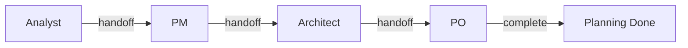
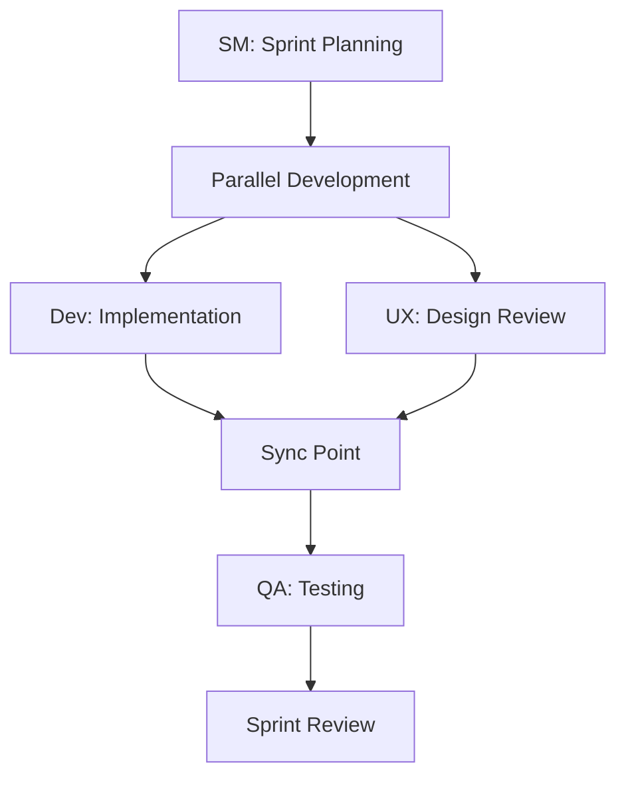

# Multi-Agent Collaboration Standards

## Overview
Standardized protocols for BMAD agent collaboration ensuring seamless coordination, consistent communication, and optimal workflow execution across all development phases.

## Core Collaboration Principles

### 1. Unified State Management
**STANDARD**: All agents operate on a single, shared workflow state with atomic updates

#### Implementation Requirements
- **State File**: `.bmad-core/workflow-state.json` as single source of truth
- **Atomic Updates**: All state changes must be atomic with rollback capability
- **State Validation**: Pre and post-operation validation required
- **Conflict Resolution**: Time-based priority with agent hierarchy fallback

```bash
# Standard state update pattern for all agents
update_workflow_state() {
    local agent_name=$1
    local new_status=$2
    local updates=$3
    
    # Backup current state
    cp .bmad-core/workflow-state.json .bmad-core/backups/state-pre-${agent_name}-$(date +%s).json
    
    # Apply updates atomically
    jq --arg agent "$agent_name" --arg status "$new_status" --argjson updates "$updates" \
       '.activeAgent = $agent | .status = $status | . += $updates' \
       .bmad-core/workflow-state.json > temp-state.json
    
    # Validate and commit
    if jq . temp-state.json >/dev/null 2>&1; then
        mv temp-state.json .bmad-core/workflow-state.json
        log_state_change "$agent_name" "$new_status" "SUCCESS"
    else
        rm temp-state.json
        log_state_change "$agent_name" "$new_status" "FAILED"
        return 1
    fi
}
```

### 2. Structured Communication Protocol
**STANDARD**: All inter-agent communication follows standardized message formats

#### Message Structure
```json
{
    "timestamp": "2024-01-15T14:30:22Z",
    "fromAgent": "analyst", 
    "toAgent": "pm",
    "messageType": "handoff|status|error|request",
    "context": {
        "currentPhase": "planning",
        "artifacts": ["docs/project-brief.md"],
        "dependencies": [],
        "blockers": []
    },
    "payload": {
        "summary": "Project brief completed successfully",
        "deliverables": ["docs/project-brief.md"],
        "nextActions": ["Create requirements document"],
        "notes": "Market analysis indicates strong demand"
    }
}
```

#### Communication Methods
**Log-Based Messaging** (Primary)
```bash
# Standard log message format
log_agent_message() {
    local from_agent=$1
    local to_agent=$2 
    local message_type=$3
    local summary=$4
    local details=$5
    
    echo "$(date -Iseconds): MSG $from_agent->$to_agent [$message_type] $summary" >> logs/agent-interactions.log
    if [ -n "$details" ]; then
        echo "$(date -Iseconds): DETAILS $details" >> logs/agent-interactions.log
    fi
}
```

**State-Based Handoffs** (For Workflow Control)
```bash
# Standard handoff procedure
execute_handoff() {
    local current_agent=$1
    local next_agent=$2
    local handoff_context=$3
    
    # Validate current agent completion
    validate_agent_completion "$current_agent"
    
    # Update workflow state
    jq --arg next "$next_agent" --arg context "$handoff_context" \
       '.nextAgent = $next | .handoffContext = $context | .completedAgents += ["'$current_agent'"]' \
       .bmad-core/workflow-state.json > temp.json
    mv temp.json .bmad-core/workflow-state.json
    
    # Log handoff
    log_agent_message "$current_agent" "$next_agent" "handoff" "$handoff_context"
    
    # Verify handoff readiness
    validate_handoff_ready "$next_agent"
}
```

### 3. Artifact Ownership and Access Control
**STANDARD**: Clear ownership model with defined access patterns

#### Ownership Matrix
| Agent | Primary Artifacts | Read Access | Modify Access |
|-------|------------------|-------------|---------------|
| Analyst | `docs/project-brief.md`, `docs/market-analysis.md` | All docs | Own artifacts only |
| PM | `docs/requirements.md`, `docs/prd.md` | All docs, analyst output | Own artifacts only |
| Architect | `docs/technical-design.md`, `docs/architecture.md` | All docs, PM output | Own artifacts only |
| PO | `tasks/epics.md`, `tasks/backlog.md` | All docs, all tasks | Own artifacts only |
| SM | `tasks/sprint-*.md`, `tasks/stories.md` | All tasks | Own artifacts only |
| Dev | `src/`, `tests/unit/` | All code, all tasks | Own artifacts only |
| QA | `qa-reports/`, `tests/integration/` | All code, all tests | Own artifacts only |
| UX-Expert | `docs/ui-specs.md`, `src/styles/` | All docs, src/components | Own artifacts only |

#### Access Control Implementation
```bash
# Artifact access control wrapper
access_artifact() {
    local agent=$1
    local operation=$2  # read|write|modify
    local artifact_path=$3
    
    # Check ownership and permissions
    if can_access_artifact "$agent" "$operation" "$artifact_path"; then
        execute_artifact_operation "$operation" "$artifact_path"
    else
        log_access_violation "$agent" "$operation" "$artifact_path"
        return 1
    fi
}

can_access_artifact() {
    local agent=$1
    local operation=$2
    local artifact_path=$3
    
    # Read access: all agents can read most artifacts
    if [ "$operation" = "read" ]; then
        return 0
    fi
    
    # Write/modify access: only artifact owners
    case "$artifact_path" in
        docs/project-brief.md|docs/market-analysis.md)
            [ "$agent" = "analyst" ] && return 0 ;;
        docs/requirements.md|docs/prd.md)
            [ "$agent" = "pm" ] && return 0 ;;
        docs/technical-design.md)
            [ "$agent" = "architect" ] && return 0 ;;
        tasks/epics.md|tasks/backlog.md)
            [ "$agent" = "po" ] && return 0 ;;
        tasks/sprint-*.md)
            [ "$agent" = "sm" ] && return 0 ;;
        src/*|tests/unit/*)
            [ "$agent" = "dev" ] && return 0 ;;
        qa-reports/*|tests/integration/*)
            [ "$agent" = "qa" ] && return 0 ;;
        docs/ui-specs.md)
            [ "$agent" = "ux-expert" ] && return 0 ;;
    esac
    
    return 1
}
```

## Agent Coordination Patterns

### 1. Sequential Coordination (Planning Phase)
**Pattern**: Linear handoff with completion validation



#### Implementation
```bash
# Sequential coordination template
execute_sequential_phase() {
    local phase_name=$1
    local agent_sequence=("$@")  # Array of agents in order
    
    for i in "${!agent_sequence[@]}"; do
        local current_agent="${agent_sequence[$i]}"
        local next_agent="${agent_sequence[$((i+1))]}"
        
        # Execute current agent
        execute_agent_workflow "$current_agent"
        
        # Validate completion
        if ! validate_agent_completion "$current_agent"; then
            handle_agent_failure "$current_agent" "$phase_name"
            return 1
        fi
        
        # Handoff to next agent (if not last)
        if [ -n "$next_agent" ]; then
            execute_handoff "$current_agent" "$next_agent" "$phase_name handoff"
        fi
    done
    
    # Mark phase complete
    mark_phase_complete "$phase_name"
}
```

### 2. Parallel Coordination (Development Phase)
**Pattern**: Concurrent execution with synchronization points



#### Implementation
```bash
# Parallel coordination template
execute_parallel_phase() {
    local phase_name=$1
    local sync_agent=$2
    shift 2
    local parallel_agents=("$@")
    
    # Start all parallel agents
    for agent in "${parallel_agents[@]}"; do
        execute_agent_workflow "$agent" &
        echo $! >> .bmad-core/parallel-pids.txt
    done
    
    # Wait for completion with timeout
    local timeout=3600  # 1 hour
    local start_time=$(date +%s)
    
    while [ -s .bmad-core/parallel-pids.txt ]; do
        local current_time=$(date +%s)
        if [ $((current_time - start_time)) -gt $timeout ]; then
            handle_parallel_timeout "$phase_name"
            return 1
        fi
        
        # Check completed agents
        check_parallel_completion
        sleep 30
    done
    
    # Execute sync agent
    execute_agent_workflow "$sync_agent"
}
```

### 3. Orchestrated Coordination (Complex Workflows)
**Pattern**: Master coordinator with dynamic task assignment

```bash
# Orchestrated coordination using bmad-master
execute_orchestrated_workflow() {
    local workflow_type=$1
    local available_agents=("$@")
    
    # Initialize orchestration
    jq '.orchestration = {
        "master": "bmad-master",
        "available_agents": $agents,
        "task_queue": [],
        "active_assignments": {}
    }' --argjson agents "$(printf '%s\n' "${available_agents[@]}" | jq -R . | jq -s .)" \
    .bmad-core/workflow-state.json > temp.json
    mv temp.json .bmad-core/workflow-state.json
    
    # Execute orchestrator
    execute_agent_workflow "bmad-master" "$workflow_type"
}
```

## Quality Gates and Validation

### 1. Agent Entry Criteria
**STANDARD**: Each agent must validate prerequisites before starting

```bash
# Standard entry validation
validate_agent_entry() {
    local agent=$1
    local phase=$2
    
    case "$agent" in
        "analyst")
            # No prerequisites for analyst (phase starter)
            return 0 ;;
        "pm")
            validate_artifact_exists "docs/project-brief.md" || return 1 ;;
        "architect") 
            validate_artifact_exists "docs/requirements.md" || return 1
            validate_artifact_exists "docs/prd.md" || return 1 ;;
        "po")
            validate_artifact_exists "docs/technical-design.md" || return 1 ;;
        "dev")
            validate_task_ready || return 1 ;;
        "qa")
            validate_implementation_complete || return 1 ;;
        "ux-expert")
            validate_ui_requirements || return 1 ;;
    esac
    
    log_agent_message "system" "$agent" "entry_validation" "PASSED"
    return 0
}
```

### 2. Agent Exit Criteria
**STANDARD**: Each agent must meet completion criteria before handoff

```bash
# Standard exit validation
validate_agent_completion() {
    local agent=$1
    
    case "$agent" in
        "analyst")
            validate_artifact_quality "docs/project-brief.md" "analyst" ;;
        "pm")
            validate_artifact_quality "docs/requirements.md" "pm"
            validate_artifact_quality "docs/prd.md" "pm" ;;
        "architect")
            validate_artifact_quality "docs/technical-design.md" "architect" ;;
        "po")
            validate_artifact_quality "tasks/epics.md" "po" ;;
        "dev")
            validate_code_quality
            validate_tests_passing ;;
        "qa") 
            validate_qa_reports_complete
            validate_test_coverage ;;
        "ux-expert")
            validate_ui_specifications
            validate_design_review ;;
    esac
}
```

### 3. Artifact Quality Standards
**STANDARD**: Consistent quality criteria for all deliverables

```bash
# Artifact quality validation
validate_artifact_quality() {
    local artifact_path=$1
    local agent_type=$2
    
    # Basic existence and format checks
    [ -f "$artifact_path" ] || { log_quality_fail "$artifact_path" "missing"; return 1; }
    [ -s "$artifact_path" ] || { log_quality_fail "$artifact_path" "empty"; return 1; }
    
    # Content quality checks based on artifact type
    case "$artifact_path" in
        *.md)
            validate_markdown_structure "$artifact_path"
            validate_required_sections "$artifact_path" "$agent_type" ;;
        *.json)
            jq . "$artifact_path" >/dev/null 2>&1 || { log_quality_fail "$artifact_path" "invalid_json"; return 1; } ;;
        *.js|*.ts)
            validate_code_syntax "$artifact_path" ;;
    esac
    
    log_quality_pass "$artifact_path" "$agent_type"
    return 0
}
```

## Error Handling and Recovery

### 1. Agent Failure Handling
**STANDARD**: Systematic failure detection and recovery

```bash
# Standard failure handling
handle_agent_failure() {
    local failed_agent=$1
    local phase=$2
    local error_context=$3
    
    # Log failure
    log_agent_message "system" "$failed_agent" "failure" "$error_context"
    
    # Update workflow state
    jq --arg agent "$failed_agent" --arg error "$error_context" \
       '.status = "error" | .errorAgent = $agent | .errorContext = $error' \
       .bmad-core/workflow-state.json > temp.json
    mv temp.json .bmad-core/workflow-state.json
    
    # Determine recovery strategy
    case "$failed_agent" in
        "analyst"|"pm"|"architect"|"po")
            # Planning agents: retry with human intervention
            schedule_human_review "$failed_agent" "$phase" ;;
        "dev"|"qa")
            # Development agents: fallback to manual process
            create_manual_task "$failed_agent" "$phase" ;;
        "bmad-master"|"bmad-orchestrator")
            # Orchestration agents: escalate to emergency procedures
            trigger_emergency_recovery ;;
    esac
}
```

### 2. Deadlock Resolution
**STANDARD**: Detection and resolution of workflow deadlocks

```bash
# Deadlock detection and resolution
detect_and_resolve_deadlock() {
    # Check for circular dependencies
    if detect_circular_dependencies; then
        resolve_circular_dependencies
    fi
    
    # Check for resource conflicts
    if detect_resource_conflicts; then
        resolve_resource_conflicts
    fi
    
    # Check for agent timeouts
    if detect_agent_timeouts; then
        resolve_agent_timeouts
    fi
}
```

## Performance Optimization

### 1. Workflow Performance Metrics
**STANDARD**: Consistent performance tracking across all agents

```bash
# Performance tracking wrapper
track_agent_performance() {
    local agent=$1
    local operation=$2
    shift 2
    local start_time=$(date +%s)
    
    # Execute operation
    "$@"
    local exit_code=$?
    
    local end_time=$(date +%s)
    local duration=$((end_time - start_time))
    
    # Record performance
    echo "$(date -Iseconds): PERF $agent $operation duration=${duration}s exit_code=$exit_code" >> logs/performance.log
    
    # Update metrics
    update_performance_metrics "$agent" "$operation" "$duration" "$exit_code"
    
    return $exit_code
}
```

### 2. Resource Management
**STANDARD**: Efficient resource utilization across agents

```bash
# Resource allocation tracking
allocate_resources() {
    local agent=$1
    local resources_needed=$2
    
    # Check available resources
    local available=$(get_available_resources)
    
    if [ "$resources_needed" -le "$available" ]; then
        # Allocate resources
        jq --argjson needed "$resources_needed" --arg agent "$agent" \
           '.resources.allocated[$agent] = $needed | .resources.available -= $needed' \
           .bmad-core/workflow-state.json > temp.json
        mv temp.json .bmad-core/workflow-state.json
        return 0
    else
        log_resource_shortage "$agent" "$resources_needed" "$available"
        return 1
    fi
}
```

## Integration Standards

### 1. Hook System Integration
**STANDARD**: All agents integrate with the Claude Code hook system

```json
{
  "hooks": {
    "PostToolUse": [
      {
        "matcher": "Task",
        "hooks": [
          {
            "type": "command",
            "comment": "Agent activity tracking",
            "command": "if echo \"$TOOL_OUTPUT\" | grep -E '(/analyst|/pm|/architect|/po|/sm|/dev|/qa|/ux-expert)'; then log_agent_execution \"$TOOL_OUTPUT\"; fi"
          }
        ]
      }
    ],
    "PreToolUse": [
      {
        "matcher": "Task",
        "hooks": [
          {
            "type": "command", 
            "comment": "Pre-execution validation",
            "command": "if echo \"$TOOL_INPUT\" | grep -E '(/analyst|/pm|/architect|/po|/sm|/dev|/qa|/ux-expert)'; then validate_agent_ready \"$TOOL_INPUT\"; fi"
          }
        ]
      }
    ]
  }
}
```

### 2. External Tool Integration
**STANDARD**: Consistent external tool integration patterns

```bash
# Standard external integration pattern
integrate_external_tool() {
    local tool_name=$1
    local agent=$2
    local operation=$3
    
    # Pre-integration checks
    validate_tool_available "$tool_name"
    validate_integration_permissions "$agent" "$tool_name"
    
    # Execute integration
    case "$tool_name" in
        "slack")
            send_slack_notification "$agent" "$operation" ;;
        "jira")
            update_jira_status "$agent" "$operation" ;;
        "github")
            create_github_issue "$agent" "$operation" ;;
    esac
    
    # Post-integration logging
    log_external_integration "$tool_name" "$agent" "$operation"
}
```

These standards ensure all BMAD agents work together harmoniously while maintaining system integrity, performance, and reliability throughout the entire development lifecycle.