# Task Decomposition: Context Engineering & Ultrathink Implementation

## Executive Summary

This document breaks down the Context Engineering Patterns and Ultrathink Implementation into precise 15-30 minute micro-tasks following our Surgical Precision Protocol. Each task has clear boundaries, success criteria, and dependency chains for systematic implementation.

## 1. Task Decomposition Framework

### 1.1 Micro-Task Structure

Each task follows this structure:
- **Duration**: 15-30 minutes maximum
- **Dependencies**: Clear prerequisite tasks
- **Deliverable**: Specific, measurable outcome
- **Success Criteria**: Validation requirements
- **Risk Level**: Low/Medium/High assessment
- **Debt Impact**: Reference to technical debt decisions

### 1.2 Implementation Sequence Overview

```mermaid
gantt
    title Context Engineering & Ultrathink Implementation Sequence
    dateFormat  X
    axisFormat %s

    section Foundation
    Task 01 Sequential Thinking     :task01, 0, 20
    Task 02 Memory Extensions       :task02, 5, 15
    
    section Context Engineering  
    Task 03 Server Structure       :task03, after task01, 15
    Task 04 Compression Engine     :task04, after task03, 20
    Task 05 Relevance Scoring      :task05, after task02, 15
    Task 06 Context Sharing        :task06, after task05, 20
    
    section Ultrathink
    Task 07 Server Structure       :task07, after task01, 15
    Task 08 Reasoning Engine       :task08, after task07, 25
    Task 09 Perspective Analysis   :task09, after task08, 15
    Task 10 Solution Evaluation    :task10, after task09, 15
    
    section Integration
    Task 11 Cross Integration      :task11, after task06, 15
    Task 12 Testing & Validation   :task12, after task11, 10
```

## 2. Foundation Infrastructure Tasks (Phase 1)

### Task 01: Sequential Thinking MCP Server Implementation
**Duration**: 20 minutes | **Risk**: Medium | **Dependencies**: None

**Objective**: Create functional Sequential Thinking MCP Server with basic linear reasoning capability

**Micro-Task Breakdown**:
1. **Server Structure Setup** (5 minutes)
   - Create TypeScript project structure
   - Configure package.json and tsconfig.json
   - Set up basic MCP server boilerplate

2. **Linear Reasoning Implementation** (10 minutes)
   - Implement ReasoningSession interface
   - Create basic linear reasoning workflow
   - Add reasoning step management

3. **MCP Tools Integration** (5 minutes)
   - Define start_reasoning and continue_reasoning tools
   - Implement tool handlers with input validation
   - Test basic MCP server functionality

**Success Criteria**:
- ✅ MCP server starts and responds to health checks
- ✅ Linear reasoning session can be created and managed
- ✅ Basic reasoning tools accessible through Claude Code

**Deliverables**:
- `sequential-thinking-server.ts` with working linear reasoning
- `package.json` with required dependencies
- Basic test demonstrating reasoning session creation

**Technical Debt Impact**: DEBT-UT-001 - Simplified reasoning patterns only

### Task 02: Memory MCP Server Extensions Assessment
**Duration**: 15 minutes | **Risk**: Low | **Dependencies**: None

**Objective**: Assess current Memory MCP capabilities and implement necessary extensions for context management

**Micro-Task Breakdown**:
1. **Capability Assessment** (5 minutes)
   - Test current memory MCP server tools
   - Identify required extensions for context storage
   - Document compatibility findings

2. **Context Storage Extensions** (5 minutes)
   - Add context metadata storage capability
   - Implement context compression storage hooks
   - Test context storage and retrieval

3. **Cross-Agent Sharing Setup** (5 minutes)
   - Configure agent-to-agent context sharing protocols
   - Test context sharing between mock agents
   - Validate data consistency

**Success Criteria**:
- ✅ Current memory MCP capabilities documented
- ✅ Context storage extensions functional
- ✅ Cross-agent sharing protocols operational

**Deliverables**:
- Memory MCP assessment report
- Extended context storage capability
- Working cross-agent context sharing

**Technical Debt Impact**: None - building on existing stable infrastructure

## 3. Context Engineering Implementation Tasks (Phase 2)

### Task 03: Context Engineering MCP Server Structure
**Duration**: 15 minutes | **Risk**: Low | **Dependencies**: Task 01

**Objective**: Create Context Engineering MCP Server with basic structure and tool interfaces

**Micro-Task Breakdown**:
1. **Server Project Setup** (5 minutes)
   - Create TypeScript project for Context Engineering server
   - Configure dependencies and build system
   - Set up basic MCP server framework

2. **Tool Interface Definition** (5 minutes)
   - Define 6 MCP tools for context operations
   - Create input/output schemas for each tool
   - Implement basic tool handler stubs

3. **Database Integration** (5 minutes)
   - Configure SQLite database connection
   - Create context storage tables
   - Test basic database operations

**Success Criteria**:
- ✅ Context Engineering MCP server structure complete
- ✅ All 6 tool interfaces defined and accessible
- ✅ Database connection and basic operations working

**Deliverables**:
- `context-engineering-server.ts` with tool definitions
- SQLite database schema for context storage
- Basic server functionality test

**Technical Debt Impact**: None - foundational structure work

### Task 04: Context Compression Engine Implementation
**Duration**: 20 minutes | **Risk**: Medium | **Dependencies**: Task 03

**Objective**: Implement statistical context compression with 60-70% compression ratio capability

**Micro-Task Breakdown**:
1. **Compression Algorithm Setup** (8 minutes)
   - Implement statistical compression using zlib
   - Create compression quality validation
   - Add compression ratio calculation

2. **Compression Tool Implementation** (7 minutes)
   - Implement compress_context MCP tool
   - Add input validation and error handling
   - Test compression with various context sizes

3. **Security and Storage Integration** (5 minutes)
   - Add encryption for compressed context data
   - Integrate with Memory MCP for storage
   - Implement integrity validation

**Success Criteria**:
- ✅ Compression achieves 60-70% size reduction consistently
- ✅ Compressed data maintains integrity and security
- ✅ compress_context tool functional through Claude Code

**Deliverables**:
- Working context compression engine
- compress_context MCP tool with full functionality
- Compression quality validation and metrics

**Technical Debt Impact**: DEBT-CE-001 - Simplified statistical compression only

### Task 05: Relevance Scoring System Implementation
**Duration**: 15 minutes | **Risk**: Low | **Dependencies**: Task 02

**Objective**: Create keyword-based and temporal relevance scoring for context elements

**Micro-Task Breakdown**:
1. **Scoring Algorithm Implementation** (8 minutes)
   - Implement keyword-based relevance scoring
   - Add temporal relevance calculation
   - Create scoring normalization (0-100 scale)

2. **Scoring Tool Development** (4 minutes)
   - Implement score_context_relevance MCP tool
   - Add batch scoring capability for multiple elements
   - Test scoring accuracy with sample data

3. **Performance Optimization** (3 minutes)
   - Add scoring result caching
   - Implement batch processing for efficiency
   - Validate sub-100ms response time requirement

**Success Criteria**:
- ✅ Relevance scoring produces meaningful rankings
- ✅ Response time consistently under 100ms
- ✅ score_context_relevance tool functional

**Deliverables**:
- Relevance scoring engine with keyword and temporal algorithms
- score_context_relevance MCP tool
- Performance validation results

**Technical Debt Impact**: DEBT-CE-002 - Basic keyword/temporal scoring only

### Task 06: Cross-Agent Context Sharing Implementation
**Duration**: 20 minutes | **Risk**: Medium | **Dependencies**: Task 05

**Objective**: Implement secure context sharing between agents with access controls

**Micro-Task Breakdown**:
1. **Sharing Protocol Implementation** (8 minutes)
   - Implement agent-to-agent context sharing
   - Add access control validation
   - Create sharing audit logging

2. **Security and Encryption** (7 minutes)
   - Add end-to-end encryption for shared context
   - Implement access permission checking
   - Test security controls with mock agents

3. **Sharing Tools Development** (5 minutes)
   - Implement share_context_cross_agent MCP tool
   - Add manage_context_permissions tool
   - Test sharing workflow end-to-end

**Success Criteria**:
- ✅ Secure context sharing working between agents
- ✅ Access controls properly enforced
- ✅ Sharing tools functional through Claude Code

**Deliverables**:
- Cross-agent context sharing system
- share_context_cross_agent and manage_context_permissions tools
- Security validation and audit logging

**Technical Debt Impact**: None - full security implementation required

## 4. Ultrathink Implementation Tasks (Phase 3)

### Task 07: Ultrathink MCP Server Structure
**Duration**: 15 minutes | **Risk**: Low | **Dependencies**: Task 01

**Objective**: Create Ultrathink MCP Server structure with reasoning tool interfaces

**Micro-Task Breakdown**:
1. **Server Project Setup** (5 minutes)
   - Create TypeScript project for Ultrathink server
   - Configure dependencies including Sequential Thinking integration
   - Set up basic MCP server framework

2. **Tool Interface Definition** (5 minutes)
   - Define 8 MCP tools for reasoning operations
   - Create comprehensive input/output schemas
   - Implement tool handler stubs

3. **Sequential Thinking Integration** (5 minutes)
   - Configure connection to Sequential Thinking MCP server
   - Test basic reasoning session integration
   - Validate communication protocols

**Success Criteria**:
- ✅ Ultrathink MCP server structure complete
- ✅ All 8 tool interfaces defined and accessible
- ✅ Sequential Thinking MCP integration functional

**Deliverables**:
- `ultrathink-server.ts` with tool definitions
- Sequential Thinking MCP integration
- Basic reasoning workflow test

**Technical Debt Impact**: None - foundational structure work

### Task 08: Deep Reasoning Engine Implementation
**Duration**: 25 minutes | **Risk**: High | **Dependencies**: Task 07

**Objective**: Implement linear sequential reasoning with basic branching capability

**Micro-Task Breakdown**:
1. **Linear Reasoning Implementation** (12 minutes)
   - Implement linear sequential reasoning workflow
   - Create reasoning step validation
   - Add confidence scoring for reasoning chains

2. **Basic Branching Support** (8 minutes)
   - Add simple branching capability to reasoning
   - Implement branch point management
   - Test branching with sample problems

3. **Reasoning Tools Development** (5 minutes)
   - Implement activate_deep_reasoning MCP tool
   - Add continue_reasoning_chain tool
   - Test reasoning workflow through Claude Code

**Success Criteria**:
- ✅ Linear reasoning handles complex problems effectively
- ✅ Basic branching capability functional
- ✅ Reasoning tools accessible and working

**Deliverables**:
- Deep reasoning engine with linear and basic branching
- activate_deep_reasoning and continue_reasoning_chain tools
- Reasoning quality validation framework

**Technical Debt Impact**: DEBT-UT-001 - Linear focus vs full reasoning patterns

### Task 09: Multi-Perspective Analysis Implementation
**Duration**: 15 minutes | **Risk**: Low | **Dependencies**: Task 08

**Objective**: Implement manual perspective analysis for technical, business, and security viewpoints

**Micro-Task Breakdown**:
1. **Perspective Frameworks** (8 minutes)
   - Implement technical perspective analysis
   - Add business perspective analysis
   - Create security perspective analysis

2. **Analysis Coordination** (4 minutes)
   - Implement cross-perspective consistency checking
   - Add perspective weight management
   - Test multi-perspective analysis workflow

3. **Analysis Tools Development** (3 minutes)
   - Implement analyze_multi_perspective MCP tool
   - Add perspective configuration capability
   - Test analysis through Claude Code

**Success Criteria**:
- ✅ Three perspective analyses (technical, business, security) functional
- ✅ Cross-perspective consistency checking working
- ✅ analyze_multi_perspective tool operational

**Deliverables**:
- Multi-perspective analysis engine
- analyze_multi_perspective MCP tool
- Perspective analysis validation framework

**Technical Debt Impact**: DEBT-UT-002 - Manual perspective configuration

### Task 10: Solution Evaluation and Ranking Implementation
**Duration**: 15 minutes | **Risk**: Low | **Dependencies**: Task 09

**Objective**: Implement solution evaluation with multi-criteria ranking and recommendation

**Micro-Task Breakdown**:
1. **Evaluation Framework** (8 minutes)
   - Implement multi-criteria solution evaluation
   - Add risk and feasibility assessment
   - Create solution ranking algorithm

2. **Recommendation Engine** (4 minutes)
   - Implement solution recommendation generation
   - Add justification and confidence scoring
   - Test recommendation quality

3. **Evaluation Tools Development** (3 minutes)
   - Implement evaluate_solutions MCP tool
   - Add generate_solution_recommendation tool
   - Test evaluation workflow

**Success Criteria**:
- ✅ Solution evaluation produces meaningful rankings
- ✅ Recommendations include justification and confidence
- ✅ Evaluation tools functional through Claude Code

**Deliverables**:
- Solution evaluation and ranking engine
- evaluate_solutions and generate_solution_recommendation tools
- Evaluation quality validation framework

**Technical Debt Impact**: None - full evaluation implementation

## 5. Integration and Validation Tasks (Phase 4)

### Task 11: Cross-System Integration Implementation
**Duration**: 15 minutes | **Risk**: Medium | **Dependencies**: Task 06, Task 10

**Objective**: Integrate Context Engineering and Ultrathink systems for seamless operation

**Micro-Task Breakdown**:
1. **Context-Reasoning Integration** (8 minutes)
   - Implement context flow from Context Engineering to Ultrathink
   - Add reasoning results feedback to context relevance
   - Test bidirectional data flow

2. **Performance Integration** (4 minutes)
   - Integrate performance monitoring across both systems
   - Add cross-system metrics collection
   - Test performance under integrated load

3. **Claude Code Integration** (3 minutes)
   - Register both MCP servers in Claude Code settings
   - Test all tools accessible through Claude Code interface
   - Validate integrated workflow functionality

**Success Criteria**:
- ✅ Context and reasoning systems communicate effectively
- ✅ Performance monitoring operational across both systems
- ✅ All tools accessible through unified Claude Code interface

**Deliverables**:
- Cross-system integration layer
- Unified performance monitoring
- Complete Claude Code MCP registration

**Technical Debt Impact**: None - essential integration work

### Task 12: Testing and Validation Implementation
**Duration**: 10 minutes | **Risk**: Low | **Dependencies**: Task 11

**Objective**: Comprehensive testing and validation of complete integrated system

**Micro-Task Breakdown**:
1. **Functionality Testing** (4 minutes)
   - Test all Context Engineering tools with real data
   - Test all Ultrathink tools with complex problems
   - Validate integrated workflows

2. **Performance Validation** (3 minutes)
   - Validate performance requirements met
   - Test system under expected load conditions
   - Verify security controls operational

3. **Integration Acceptance** (3 minutes)
   - Run complete end-to-end test scenarios
   - Validate all success criteria met
   - Document any issues or limitations

**Success Criteria**:
- ✅ All functional requirements validated
- ✅ Performance requirements met under test conditions
- ✅ Security controls operational and validated
- ✅ Integration acceptance criteria satisfied

**Deliverables**:
- Complete system validation report
- Performance benchmarking results
- Security validation confirmation
- Integration acceptance sign-off

**Technical Debt Impact**: Full system validation with documented debt items

## 6. Task Implementation Guidelines

### 6.1 Micro-Task Execution Protocol

**Before Starting Each Task**:
1. Review task dependencies and ensure prerequisites complete
2. Load relevant context from previous tasks and documentation
3. Set up development environment with required tools and servers
4. Review technical debt impact and constraints for the task

**During Task Execution**:
1. Follow surgical precision - implement minimum viable solution first
2. Validate each component before proceeding to next step
3. Document any issues or deviations from planned approach
4. Test functionality immediately after implementation

**After Completing Each Task**:
1. Update TodoWrite to mark task as completed
2. Validate all success criteria achieved
3. Document deliverables and any technical debt created
4. Prepare context and handoff information for next task

### 6.2 Quality Gates and Validation

**Level 1 Validation** (After each micro-task):
- Code compiles and runs without errors
- Basic functionality tests pass
- Success criteria met

**Level 2 Validation** (After each phase):
- Integration tests pass
- Performance requirements met
- Security controls validated

**Level 3 Validation** (After complete implementation):
- End-to-end workflows functional
- All acceptance criteria satisfied
- Technical debt properly documented and tracked

## 7. Risk Management and Contingencies

### 7.1 Task-Level Risk Mitigation

**High-Risk Tasks**:
- **Task 01** (Sequential Thinking): Start with minimal implementation, defer advanced features
- **Task 04** (Context Compression): Use proven compression libraries, implement validation early
- **Task 08** (Deep Reasoning): Focus on linear reasoning first, add branching incrementally

**Medium-Risk Tasks**:
- **Task 06** (Context Sharing): Implement basic sharing first, add security incrementally
- **Task 11** (Integration): Test components individually before integration

**Low-Risk Tasks**:
- Most structure and tool definition tasks have minimal implementation risk

### 7.2 Contingency Plans

**If Task Exceeds Time Limit**:
1. Complete minimum viable implementation
2. Document remaining work as technical debt
3. Proceed to next task to maintain overall timeline
4. Schedule debt remediation in future sprint

**If Critical Dependency Blocked**:
1. Implement workaround using available infrastructure
2. Document dependency issue and alternative approach
3. Continue with modified implementation plan
4. Address dependency in next available window

**If Integration Issues Arise**:
1. Isolate issue to specific component
2. Implement temporary workaround if needed
3. Address integration issue in dedicated debugging session
4. Validate fix doesn't impact other components

## 8. Success Metrics and Completion Criteria

### 8.1 Task-Level Success Metrics

**Context Engineering Tasks**:
- Compression ratio: 60-70% minimum
- Relevance scoring: sub-100ms response time
- Context sharing: 99%+ consistency

**Ultrathink Tasks**:
- Reasoning quality: 80%+ success for linear problems
- Perspective analysis: 95%+ coverage
- Solution evaluation: 90%+ ranking accuracy

**Integration Tasks**:
- Cross-system communication: 100% reliability
- Performance: All requirements met
- Security: All controls operational

### 8.2 Overall Completion Criteria

**Phase 5.5 Success Definition**:
- ✅ All 12 micro-tasks completed successfully
- ✅ Context Engineering system operational with required capabilities
- ✅ Ultrathink system providing working deep reasoning
- ✅ Both systems integrated and accessible through Claude Code
- ✅ All technical debt properly documented and scheduled for remediation
- ✅ Performance and security requirements validated
- ✅ Foundation established for Phase 6 Vibe Coding integration

## 9. Implementation Timeline Summary

**Total Duration**: 95 minutes (165 minutes if no debt decisions taken)
**Critical Path**: 75 minutes
**Parallel Opportunities**: 20 minutes
**Risk Buffer**: Included in individual task estimates

**Phase 1 Foundation** (20 minutes): Tasks 01-02
**Phase 2 Context Engineering** (55 minutes): Tasks 03-06  
**Phase 3 Ultrathink** (50 minutes): Tasks 07-10
**Phase 4 Integration** (25 minutes): Tasks 11-12

**Debt Remediation Timeline**:
- Sprint 15-16: DEBT-CE-001 (Advanced compression)
- Sprint 16-17: DEBT-CE-002 (Semantic scoring)
- Sprint 16-18: DEBT-UT-001 (Full reasoning patterns)
- Sprint 20: DEBT-UT-002 (Automatic perspectives)

This task decomposition provides a clear, systematic approach to implementing Context Engineering Patterns and Ultrathink Implementation with surgical precision and proper debt management.