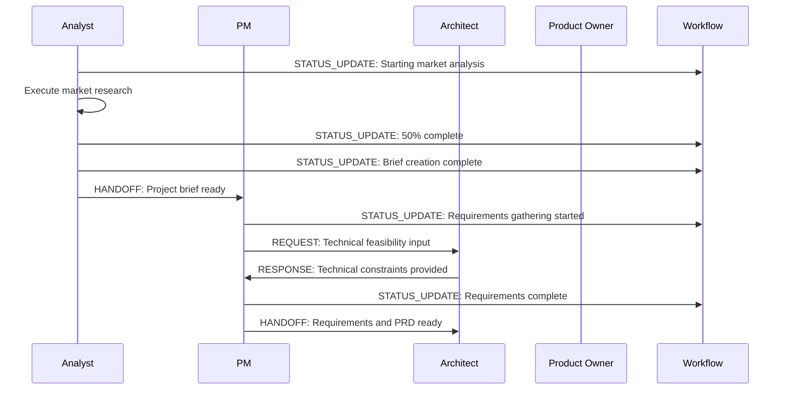
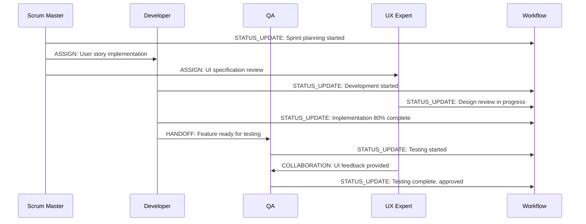
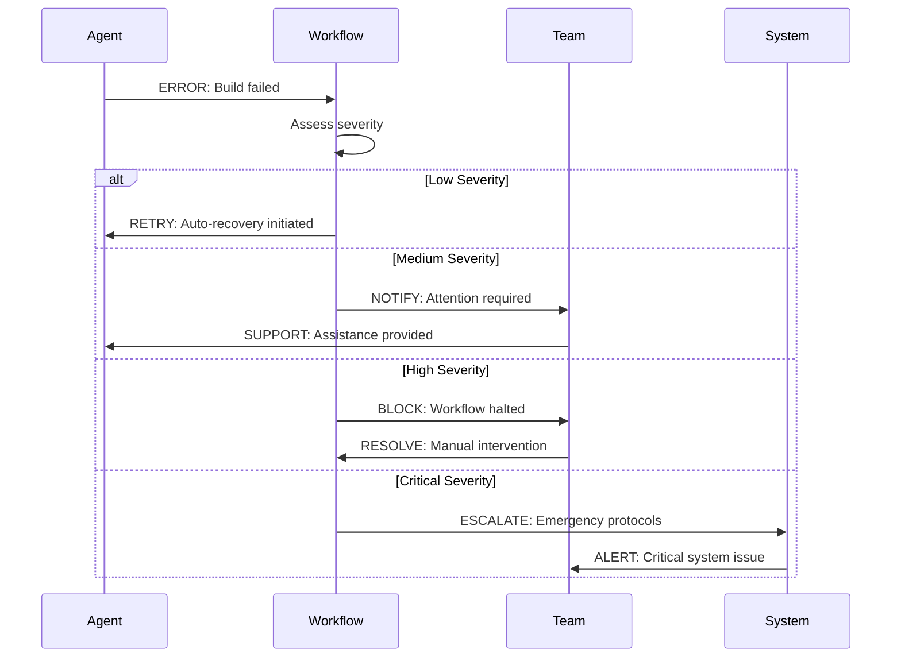

# Team Communication Protocols

## Overview
Standardized communication protocols for BMAD agent teams ensuring clear, efficient, and traceable communication across all development phases.

## Communication Channels

### 1. Primary Communication Channels
| Channel | Purpose | Format | Retention |
|---------|---------|---------|-----------|
| **Agent Activity Log** | Claude Code integration | Structured log | Persistent |
| **Workflow Progress Log** | State transitions | Timestamped entries | Persistent |
| **Agent Interactions Log** | Inter-agent messaging | Structured messages | Persistent |
| **Development Log** | Code changes | Development activity | Persistent |

### 2. Channel Usage Guidelines

**Agent Activity Log** (`.claude/agent-activity.log`)
- All Claude Code agent executions
- Hook system notifications
- System-level events

**Workflow Progress Log** (`logs/workflow-progress.log`)
- Phase transitions (PHASE_START, PHASE_COMPLETE)
- Agent state changes (ACTIVE, COMPLETED, FAILED)
- Milestone achievements

**Agent Interactions Log** (`logs/agent-interactions.log`)
- Agent handoffs (HANDOFF)
- Cross-agent messages (MSG)
- Collaboration events

**Development Log** (`logs/development.log`)
- Code commits and changes
- Build and test results
- Development milestones

## Message Standards

### 1. Log Message Format
```bash
# Standard format: [TIMESTAMP] LEVEL COMPONENT ACTION STATUS [DETAILS]
[2024-01-15T14:30:22Z] INFO ANALYST BRIEFING_CREATE SUCCESS Project brief completed
[2024-01-15T14:31:05Z] INFO WORKFLOW HANDOFF SUCCESS analyst -> pm
[2024-01-15T14:32:18Z] WARN PM REQUIREMENTS_VALIDATION RETRY Missing stakeholder input
[2024-01-15T14:35:42Z] ERROR DEV BUILD_FAILED BLOCKED Missing dependency: react@18.0.0
```

### 2. Structured Messaging Protocol
```bash
# Standard messaging function
send_team_message() {
    local level=$1      # INFO|WARN|ERROR|DEBUG
    local component=$2  # ANALYST|PM|DEV|QA|etc
    local action=$3     # BRIEFING_CREATE|HANDOFF|BUILD|etc
    local status=$4     # SUCCESS|FAILED|RETRY|BLOCKED|etc
    local details=$5    # Additional context
    
    local timestamp=$(date -Iseconds)
    local message="[$timestamp] $level $component $action $status"
    
    if [ -n "$details" ]; then
        message="$message $details"
    fi
    
    # Route to appropriate log
    case "$level" in
        "INFO")
            echo "$message" >> logs/workflow-progress.log ;;
        "WARN"|"ERROR")
            echo "$message" >> logs/workflow-progress.log
            echo "$message" >> logs/agent-interactions.log ;;
        "DEBUG")
            echo "$message" >> .claude/agent-activity.log ;;
    esac
}
```

## Agent Communication Patterns

### 1. Handoff Communication
```bash
# Standard agent handoff protocol
execute_agent_handoff() {
    local from_agent=$1
    local to_agent=$2
    local handoff_summary=$3
    local deliverables=("${@:4}")
    
    # Pre-handoff validation
    validate_handoff_readiness "$from_agent" "$to_agent"
    
    # Create handoff package
    local handoff_data=$(create_handoff_package "$from_agent" "$to_agent" "$deliverables[@]")
    
    # Execute handoff
    send_team_message "INFO" "$from_agent" "HANDOFF_INITIATE" "SUCCESS" "to $to_agent: $handoff_summary"
    
    # Update workflow state
    update_workflow_state_handoff "$from_agent" "$to_agent" "$handoff_data"
    
    # Confirm handoff received
    send_team_message "INFO" "$to_agent" "HANDOFF_RECEIVED" "SUCCESS" "from $from_agent"
    
    # Validate handoff completion
    if validate_handoff_completion "$from_agent" "$to_agent"; then
        send_team_message "INFO" "WORKFLOW" "HANDOFF_COMPLETE" "SUCCESS" "$from_agent -> $to_agent"
    else
        send_team_message "ERROR" "WORKFLOW" "HANDOFF_FAILED" "BLOCKED" "$from_agent -> $to_agent"
        handle_handoff_failure "$from_agent" "$to_agent"
    fi
}
```

### 2. Status Updates
```bash
# Standard status update protocol
send_status_update() {
    local agent=$1
    local current_task=$2
    local progress_percent=$3
    local estimated_completion=$4
    local blockers=("${@:5}")
    
    local status_message="Task: $current_task, Progress: $progress_percent%, ETA: $estimated_completion"
    
    if [ ${#blockers[@]} -gt 0 ]; then
        local blocker_list=$(IFS=,; echo "${blockers[*]}")
        status_message="$status_message, Blockers: $blocker_list"
        send_team_message "WARN" "$agent" "STATUS_UPDATE" "BLOCKED" "$status_message"
    else
        send_team_message "INFO" "$agent" "STATUS_UPDATE" "IN_PROGRESS" "$status_message"
    fi
    
    # Update shared state
    update_agent_status "$agent" "$current_task" "$progress_percent" "$estimated_completion" "${blockers[@]}"
}
```

### 3. Error Communication
```bash
# Standard error reporting protocol
report_agent_error() {
    local agent=$1
    local error_type=$2
    local error_message=$3
    local recovery_action=$4
    local severity=$5  # LOW|MEDIUM|HIGH|CRITICAL
    
    # Log error
    send_team_message "ERROR" "$agent" "$error_type" "FAILED" "$error_message"
    
    # Create error context
    local error_context=$(create_error_context "$agent" "$error_type" "$error_message")
    
    # Escalation based on severity
    case "$severity" in
        "LOW")
            # Agent handles internally
            send_team_message "INFO" "$agent" "ERROR_RECOVERY" "RETRY" "$recovery_action" ;;
        "MEDIUM")
            # Notify team, agent handles
            send_team_message "WARN" "TEAM" "ERROR_NOTIFICATION" "ATTENTION" "$agent: $error_message"
            send_team_message "INFO" "$agent" "ERROR_RECOVERY" "RETRY" "$recovery_action" ;;
        "HIGH")
            # Block workflow, require intervention
            send_team_message "ERROR" "WORKFLOW" "ERROR_BLOCKED" "INTERVENTION" "$agent: $error_message"
            update_workflow_state_blocked "$agent" "$error_context" ;;
        "CRITICAL")
            # Emergency escalation
            send_team_message "ERROR" "SYSTEM" "CRITICAL_ERROR" "EMERGENCY" "$agent: $error_message"
            trigger_emergency_protocols "$agent" "$error_context" ;;
    esac
}
```

## Communication Flows

### 1. Planning Phase Communication Flow


### 2. Development Phase Communication Flow


### 3. Error Handling Communication Flow


## Real-Time Communication

### 1. Live Status Dashboard
```bash
# Create live status display
create_status_dashboard() {
    cat > scripts/status-dashboard.sh << 'EOF'
#!/bin/bash
# Live BMAD workflow status dashboard

while true; do
    clear
    echo "BMAD Workflow Status - $(date)"
    echo "=================================="
    
    # Current workflow state
    echo "Current Phase: $(jq -r '.currentPhase' .bmad-core/workflow-state.json)"
    echo "Active Agent: $(jq -r '.activeAgent' .bmad-core/workflow-state.json)"
    echo "Status: $(jq -r '.status' .bmad-core/workflow-state.json)"
    echo ""
    
    # Recent activity (last 5 entries)
    echo "Recent Activity:"
    echo "---------------"
    tail -5 logs/workflow-progress.log | while read line; do
        echo "  $line"
    done
    echo ""
    
    # Agent status
    echo "Agent Status:"
    echo "------------"
    for agent in analyst pm architect po sm dev qa ux-expert; do
        if grep -q "$agent" logs/agent-interactions.log 2>/dev/null; then
            local last_activity=$(grep "$agent" logs/agent-interactions.log | tail -1)
            echo "  $agent: Active"
        else
            echo "  $agent: Idle"
        fi
    done
    
    sleep 5
done
EOF
    chmod +x scripts/status-dashboard.sh
}
```

### 2. Notification System
```bash
# Push notification system
send_team_notification() {
    local priority=$1    # LOW|MEDIUM|HIGH|URGENT
    local message=$2
    local recipients=("${@:3}")
    
    # Log notification
    send_team_message "INFO" "NOTIFICATION" "SEND" "SUCCESS" "$priority: $message"
    
    # Route based on priority
    case "$priority" in
        "LOW")
            # Log only
            echo "$(date): NOTIFICATION $message" >> logs/notifications.log ;;
        "MEDIUM")
            # Log and team channel
            echo "$(date): NOTIFICATION $message" >> logs/notifications.log
            send_slack_message "$message" "#bmad-team" ;;
        "HIGH") 
            # Log, team channel, and individual notifications
            echo "$(date): NOTIFICATION $message" >> logs/notifications.log
            send_slack_message "$message" "#bmad-team"
            for recipient in "${recipients[@]}"; do
                send_direct_message "$recipient" "$message"
            done ;;
        "URGENT")
            # All channels plus emergency escalation
            echo "$(date): URGENT $message" >> logs/notifications.log
            send_slack_message "🚨 URGENT: $message" "#bmad-team"
            send_email_alert "$message" "${recipients[@]}"
            trigger_phone_alert "$message" ;;
    esac
}
```

## Communication Standards

### 1. Message Content Standards
- **Clarity**: All messages must be clear and unambiguous
- **Context**: Include sufficient context for understanding
- **Actionable**: Specify required actions when applicable
- **Timestamped**: All messages include precise timestamps
- **Traceable**: Messages link to related workflow elements

### 2. Response Time Standards
| Priority | Response Time | Acknowledgment |
|----------|---------------|----------------|
| LOW | Within 4 hours | Optional |
| MEDIUM | Within 1 hour | Required |
| HIGH | Within 15 minutes | Immediate |
| URGENT | Within 5 minutes | Immediate + Escalation |

### 3. Communication Etiquette
- Use appropriate priority levels
- Provide complete information in initial message
- Acknowledge receipt of important messages
- Update status when resolving issues
- Follow escalation procedures for blocked items

## Integration with External Tools

### 1. Slack Integration
```bash
# Slack webhook integration
send_slack_message() {
    local message=$1
    local channel=$2
    
    if [ -n "$SLACK_WEBHOOK_URL" ]; then
        curl -X POST -H 'Content-type: application/json' \
             --data "{\"text\":\"$message\",\"channel\":\"$channel\"}" \
             "$SLACK_WEBHOOK_URL" 2>/dev/null || true
    fi
}
```

### 2. Email Integration
```bash
# Email notification system
send_email_alert() {
    local message=$1
    shift
    local recipients=("$@")
    
    for recipient in "${recipients[@]}"; do
        if command -v mail >/dev/null; then
            echo "$message" | mail -s "BMAD Workflow Alert" "$recipient" 2>/dev/null || true
        fi
    done
}
```

### 3. Issue Tracking Integration
```bash
# GitHub Issues integration
create_workflow_issue() {
    local agent=$1
    local issue_title=$2
    local issue_description=$3
    local priority=$4
    
    if [ -n "$GITHUB_TOKEN" ]; then
        gh issue create \
            --title "[$agent] $issue_title" \
            --body "$issue_description" \
            --label "bmad-workflow,$priority" 2>/dev/null || true
    fi
}
```

## Monitoring and Analytics

### 1. Communication Metrics
```bash
# Communication analytics
generate_communication_report() {
    local start_date=$1
    local end_date=$2
    
    cat > reports/communication-report-$(date +%Y%m%d).md << EOF
# Communication Report: $start_date to $end_date

## Message Volume
$(grep -c "INFO\|WARN\|ERROR" logs/workflow-progress.log || echo "0") total messages
$(grep -c "INFO" logs/workflow-progress.log || echo "0") info messages
$(grep -c "WARN" logs/workflow-progress.log || echo "0") warnings  
$(grep -c "ERROR" logs/workflow-progress.log || echo "0") errors

## Agent Activity
$(for agent in analyst pm architect po sm dev qa ux-expert; do
    count=$(grep -c "$agent" logs/agent-interactions.log 2>/dev/null || echo "0")
    echo "- $agent: $count messages"
done)

## Response Times
Average handoff time: $(calculate_avg_handoff_time)
Error resolution time: $(calculate_avg_error_resolution)

## Top Issues
$(grep "ERROR\|WARN" logs/workflow-progress.log | sort | uniq -c | sort -nr | head -5)
EOF
}
```

### 2. Communication Health Checks
```bash
# Regular communication system health check
check_communication_health() {
    local issues=()
    
    # Check log file sizes
    for log in logs/*.log; do
        if [ $(stat -f%z "$log" 2>/dev/null || stat -c%s "$log") -gt 10485760 ]; then  # 10MB
            issues+=("Large log file: $log")
        fi
    done
    
    # Check for communication gaps
    local last_message=$(tail -1 logs/workflow-progress.log | cut -d' ' -f1)
    local current_time=$(date +%s)
    local last_time=$(date -d "$last_message" +%s 2>/dev/null || echo "0")
    local gap=$((current_time - last_time))
    
    if [ $gap -gt 3600 ]; then  # 1 hour silence
        issues+=("Communication gap: ${gap}s since last message")
    fi
    
    # Report health status
    if [ ${#issues[@]} -eq 0 ]; then
        send_team_message "INFO" "SYSTEM" "HEALTH_CHECK" "SUCCESS" "Communication system healthy"
    else
        local issue_list=$(IFS=,; echo "${issues[*]}")
        send_team_message "WARN" "SYSTEM" "HEALTH_CHECK" "ISSUES" "$issue_list"
    fi
}
```

This communication protocol ensures clear, efficient, and traceable communication across all BMAD agents while maintaining system performance and reliability.