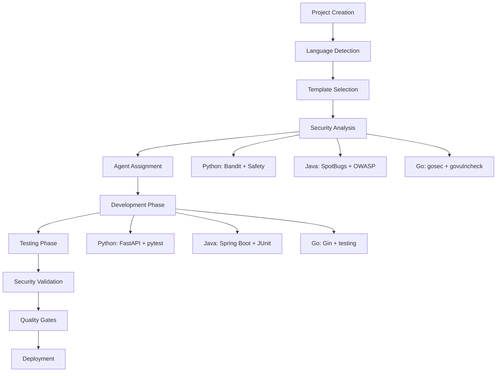

# Workspace Integration Strategy
## Multi-Language Development Environment

> **WORKSPACE PROTOCOL COMPLIANCE**: This strategy implements Laws #1-5 with focus on orchestrated efficiency and systematic protocol adherence.

## Executive Summary

This document defines the integration strategy for incorporating Python, Java, and Go development into our existing workspace while maintaining compatibility with our established protocols, tools, and workflows. The strategy ensures seamless multi-language development with unified security, testing, and quality standards.

## Current Workspace Architecture Analysis

### Existing Tool Ecosystem
```yaml
core_tools:
  ide_integration: "VS Code, Cursor, IntelliJ, JetBrains"
  version_control: "Git with GitHub Actions CI/CD"
  security_scanning: "ESLint security plugins, npm audit"
  testing_framework: "Jest, Vitest, Playwright"
  code_quality: "ESLint, Prettier, TypeScript"
  task_tracking: "TodoWrite integration"
  agent_coordination: "21 AI agents (11 Custom + 10 BMAD)"

shared_infrastructure:
  configuration: "templates/shared-config/"
  protocols: "docs/protocols/"
  automation: ".claude/hooks.json (36+ hooks)"
  workspace: ".bmad-workspace/ (multi-agent collaboration)"
  knowledge_base: "docs/knowledge-base/"
```

### Integration Compatibility Assessment
- **High Compatibility**: Git workflows, IDE integration, CI/CD pipelines
- **Medium Compatibility**: Security scanning (requires language-specific tools)
- **Low Compatibility**: Package management, build systems (language-specific)
- **New Requirements**: Language-specific linters, test frameworks, security tools

## Multi-Language Integration Architecture

### Unified Project Structure
```
my-dev-workspace/
├── templates/
│   ├── python/                    # NEW: Python FastAPI template
│   │   ├── pyproject.toml
│   │   ├── src/
│   │   ├── tests/
│   │   └── .security/
│   ├── java/                      # NEW: Java Spring Boot template
│   │   ├── pom.xml
│   │   ├── src/main/java/
│   │   ├── src/test/java/
│   │   └── .security/
│   ├── go/                        # NEW: Go Gin template
│   │   ├── go.mod
│   │   ├── cmd/
│   │   ├── internal/
│   │   └── .security/
│   └── shared-config/             # EXISTING: Cross-language configs
│       ├── security-policies/      # NEW: Unified security configs
│       ├── ci-cd-templates/       # NEW: Language-agnostic CI/CD
│       └── ide-configs/           # ENHANCED: Multi-language IDE setup
├── scripts/
│   ├── new-project.js             # ENHANCED: Multi-language support
│   ├── security-scan.sh           # NEW: Unified security scanning
│   └── quality-check.sh           # NEW: Cross-language quality gates
└── .claude/
    ├── commands/
    │   ├── python-dev.md          # NEW: Python development commands
    │   ├── java-dev.md            # NEW: Java development commands
    │   └── go-dev.md              # NEW: Go development commands
    └── agents/                    # ENHANCED: Language-specific agents
```

### Cross-Language Configuration Management

#### Unified Security Configuration
```yaml
# templates/shared-config/security-policies/unified-security.yml
security_standards:
  input_validation:
    python: "pydantic_models"
    java: "bean_validation"
    go: "custom_validators"
  
  authentication:
    python: "fastapi_oauth2_jwt"
    java: "spring_security_oauth2"
    go: "jwt_middleware"
  
  encryption:
    python: "cryptography_aes256"
    java: "spring_crypto_aes256"
    go: "crypto_aes_gcm"

vulnerability_thresholds:
  critical: 0
  high: 0
  medium: 5
  low: 20

security_gates:
  pre_commit: ["static_analysis", "dependency_check"]
  pre_merge: ["security_tests", "vulnerability_scan"]
  pre_deploy: ["penetration_test", "compliance_check"]
```

#### IDE Integration Configuration
```json
// .vscode/settings.json - Enhanced multi-language support
{
  "files.associations": {
    "*.py": "python",
    "*.java": "java",
    "*.go": "go",
    "pyproject.toml": "toml",
    "pom.xml": "xml",
    "go.mod": "go.mod"
  },
  
  "python.linting.enabled": true,
  "python.linting.banditEnabled": true,
  "python.testing.pytestEnabled": true,
  
  "java.configuration.checkProjectSettings": true,
  "java.compile.nullAnalysis.mode": "automatic",
  
  "go.lintTool": "golangci-lint",
  "go.vetOnSave": "package",
  "go.testFlags": ["-v", "-race"],
  
  "eslint.validate": ["javascript", "typescript"],
  
  "todoWrite.languages": ["python", "java", "go", "typescript", "javascript"],
  
  "security.scanOnSave": {
    "python": "bandit",
    "java": "spotbugs",
    "go": "gosec",
    "typescript": "eslint-security"
  }
}
```

## CI/CD Pipeline Integration

### Unified GitHub Actions Workflow
```yaml
# .github/workflows/multi-language-ci.yml
name: Multi-Language CI/CD Pipeline

on:
  push:
    branches: [main, develop]
  pull_request:
    branches: [main, develop]

jobs:
  detect-changes:
    runs-on: ubuntu-latest
    outputs:
      python: ${{ steps.changes.outputs.python }}
      java: ${{ steps.changes.outputs.java }}
      go: ${{ steps.changes.outputs.go }}
      typescript: ${{ steps.changes.outputs.typescript }}
    steps:
      - uses: actions/checkout@v3
      - uses: dorny/paths-filter@v2
        id: changes
        with:
          filters: |
            python:
              - 'projects/**/*.py'
              - 'projects/**/pyproject.toml'
            java:
              - 'projects/**/*.java'
              - 'projects/**/pom.xml'
            go:
              - 'projects/**/*.go'
              - 'projects/**/go.mod'
            typescript:
              - 'projects/**/*.ts'
              - 'projects/**/package.json'

  python-pipeline:
    needs: detect-changes
    if: needs.detect-changes.outputs.python == 'true'
    runs-on: ubuntu-latest
    steps:
      - uses: actions/checkout@v3
      - name: Setup Python
        uses: actions/setup-python@v4
        with:
          python-version: '3.11'
      - name: Install dependencies
        run: |
          pip install poetry
          poetry install
      - name: Security Scan
        run: |
          poetry run bandit -r . -f json -o bandit-report.json
          poetry run safety check --json --output safety-report.json
      - name: Run Tests
        run: |
          poetry run pytest --cov=. --cov-report=xml
      - name: Quality Gates
        run: |
          poetry run flake8 .
          poetry run mypy .

  java-pipeline:
    needs: detect-changes
    if: needs.detect-changes.outputs.java == 'true'
    runs-on: ubuntu-latest
    steps:
      - uses: actions/checkout@v3
      - name: Setup Java
        uses: actions/setup-java@v3
        with:
          java-version: '17'
          distribution: 'temurin'
      - name: Cache Maven dependencies
        uses: actions/cache@v3
        with:
          path: ~/.m2
          key: ${{ runner.os }}-m2-${{ hashFiles('**/pom.xml') }}
      - name: Security Scan
        run: |
          mvn compile spotbugs:check
          mvn org.owasp:dependency-check-maven:check
      - name: Run Tests
        run: |
          mvn test jacoco:report
      - name: Quality Gates
        run: |
          mvn checkstyle:check
          mvn pmd:check

  go-pipeline:
    needs: detect-changes
    if: needs.detect-changes.outputs.go == 'true'
    runs-on: ubuntu-latest
    steps:
      - uses: actions/checkout@v3
      - name: Setup Go
        uses: actions/setup-go@v4
        with:
          go-version: '1.21'
      - name: Install tools
        run: |
          go install golang.org/x/vuln/cmd/govulncheck@latest
          go install github.com/securecodewarrior/gosec/cmd/gosec@latest
      - name: Security Scan
        run: |
          govulncheck ./...
          gosec ./...
      - name: Run Tests
        run: |
          go test -race -coverprofile=coverage.out ./...
      - name: Quality Gates
        run: |
          go vet ./...
          gofmt -s -d .

  security-consolidation:
    needs: [python-pipeline, java-pipeline, go-pipeline]
    if: always()
    runs-on: ubuntu-latest
    steps:
      - name: Consolidate Security Reports
        run: |
          # Merge security reports from all languages
          # Generate unified security dashboard
          # Apply security gates and fail build if critical issues found
```

### Language-Specific Security Integration

#### Python Security Pipeline
```bash
#!/bin/bash
# scripts/security/python-security-scan.sh

echo "🔍 Python Security Scan Starting..."

# Static analysis with Bandit
echo "Running Bandit static analysis..."
bandit -r . -f json -o security-reports/bandit-report.json
bandit_exit_code=$?

# Dependency vulnerability check
echo "Running Safety dependency check..."
safety check --json --output security-reports/safety-report.json
safety_exit_code=$?

# License compliance check
echo "Running license compliance check..."
pip-licenses --format=json --output-file security-reports/licenses.json

# Security linting with semgrep
echo "Running Semgrep security rules..."
semgrep --config=auto --json --output security-reports/semgrep-report.json .

# Consolidate results
python scripts/security/consolidate-python-security.py

if [ $bandit_exit_code -ne 0 ] || [ $safety_exit_code -ne 0 ]; then
    echo "❌ Python security scan failed!"
    exit 1
fi

echo "✅ Python security scan completed successfully!"
```

#### Java Security Pipeline
```bash
#!/bin/bash
# scripts/security/java-security-scan.sh

echo "🔍 Java Security Scan Starting..."

# Static analysis with SpotBugs
echo "Running SpotBugs analysis..."
mvn compile spotbugs:check
spotbugs_exit_code=$?

# OWASP Dependency Check
echo "Running OWASP dependency check..."
mvn org.owasp:dependency-check-maven:check
owasp_exit_code=$?

# PMD security rules
echo "Running PMD security analysis..."
mvn pmd:check

# Checkstyle security rules
echo "Running Checkstyle security rules..."
mvn checkstyle:check

if [ $spotbugs_exit_code -ne 0 ] || [ $owasp_exit_code -ne 0 ]; then
    echo "❌ Java security scan failed!"
    exit 1
fi

echo "✅ Java security scan completed successfully!"
```

#### Go Security Pipeline
```bash
#!/bin/bash
# scripts/security/go-security-scan.sh

echo "🔍 Go Security Scan Starting..."

# Vulnerability database check
echo "Running govulncheck..."
govulncheck ./...
govuln_exit_code=$?

# Static analysis with gosec
echo "Running gosec security analysis..."
gosec -fmt json -out security-reports/gosec-report.json ./...
gosec_exit_code=$?

# Additional security checks
echo "Running staticcheck..."
staticcheck ./...

echo "Running go vet..."
go vet ./...

if [ $govuln_exit_code -ne 0 ] || [ $gosec_exit_code -ne 0 ]; then
    echo "❌ Go security scan failed!"
    exit 1
fi

echo "✅ Go security scan completed successfully!"
```

## Agent Integration Strategy

### Multi-Language Agent Configuration

#### Enhanced Custom Agents
```yaml
# .claude/agents/multi-language-agents.yml
agents:
  language_specialists:
    python-developer:
      expertise: ["fastapi", "django", "pytest", "pydantic"]
      security_focus: ["bandit", "safety", "pydantic_validation"]
      protocols: ["security_first", "tdd", "task_decomposition"]
    
    java-developer:
      expertise: ["spring_boot", "spring_security", "junit", "maven"]
      security_focus: ["spotbugs", "owasp_dependency_check", "spring_security"]
      protocols: ["security_first", "tdd", "enterprise_patterns"]
    
    go-developer:
      expertise: ["gin", "echo", "testing", "modules"]
      security_focus: ["gosec", "govulncheck", "crypto_go"]
      protocols: ["security_first", "performance_optimization", "microservices"]

  cross_language_specialists:
    security-architect:
      expertise: ["threat_modeling", "compliance", "security_testing"]
      languages: ["python", "java", "go", "typescript"]
      protocols: ["security_first_mandatory"]
    
    integration-specialist:
      expertise: ["ci_cd", "docker", "kubernetes", "monitoring"]
      languages: ["all"]
      protocols: ["orchestrated_efficiency"]
```

#### Agent Coordination Protocol
```typescript
// .bmad-workspace/agent-coordination.ts
interface MultiLanguageAgentCoordination {
  projectAnalysis: {
    detectLanguages(): string[];
    selectOptimalAgents(languages: string[]): AgentTeam;
    validateCapabilities(agents: AgentTeam, requirements: ProjectRequirements): boolean;
  };
  
  taskDistribution: {
    assignSecurityTasks(language: string): SecurityAgent;
    assignDevelopmentTasks(language: string, complexity: number): DevelopmentAgent;
    assignTestingTasks(language: string, testType: string): TestingAgent;
  };
  
  qualityGates: {
    validateSecurityCompliance(language: string): Promise<SecurityResult>;
    validateTestCoverage(language: string): Promise<CoverageResult>;
    validateCodeQuality(language: string): Promise<QualityResult>;
  };
}
```

### TodoWrite Multi-Language Integration

#### Enhanced Task Tracking
```typescript
// Enhanced TodoWrite for multi-language projects
interface MultiLanguageTask extends Task {
  language: 'python' | 'java' | 'go' | 'typescript' | 'javascript';
  framework: string;
  securityRequirements: SecurityRequirement[];
  testRequirements: TestRequirement[];
  agentAssignment: AgentId;
}

interface SecurityRequirement {
  type: 'authentication' | 'authorization' | 'input_validation' | 'encryption';
  standard: string; // OWASP, NIST, etc.
  implementation: string; // language-specific implementation
  validationCriteria: string[];
}
```

## Tool Ecosystem Integration

### Package Manager Integration
```yaml
# scripts/unified-dependency-management.yml
dependency_managers:
  python:
    primary: "poetry"
    commands:
      install: "poetry install"
      update: "poetry update"
      security_check: "poetry run safety check"
      
  java:
    primary: "maven"
    commands:
      install: "mvn install"
      update: "mvn versions:use-latest-versions"
      security_check: "mvn org.owasp:dependency-check-maven:check"
      
  go:
    primary: "go_modules"
    commands:
      install: "go mod download"
      update: "go get -u ./..."
      security_check: "govulncheck ./..."
      
  typescript:
    primary: "npm"
    commands:
      install: "npm install"
      update: "npm update"
      security_check: "npm audit"
```

### Unified Command Interface
```bash
#!/bin/bash
# scripts/unified-commands.sh

# Universal commands that work across all languages
project_command() {
  local command=$1
  local language=$(detect_project_language)
  
  case $command in
    "install")
      case $language in
        "python") poetry install ;;
        "java") mvn install ;;
        "go") go mod download ;;
        "typescript") npm install ;;
      esac
      ;;
    "test")
      case $language in
        "python") poetry run pytest ;;
        "java") mvn test ;;
        "go") go test ./... ;;
        "typescript") npm test ;;
      esac
      ;;
    "security")
      ./scripts/security/${language}-security-scan.sh
      ;;
    "quality")
      ./scripts/quality/${language}-quality-check.sh
      ;;
  esac
}

# Usage: project_command install|test|security|quality
```

## Development Workflow Integration

### Unified Development Lifecycle


### Cross-Language Quality Gates
```yaml
# quality_gates.yml
quality_gates:
  code_quality:
    python:
      linting: "flake8 --max-line-length=88"
      formatting: "black --check ."
      type_checking: "mypy ."
      complexity: "radon cc . --min B"
    
    java:
      linting: "mvn checkstyle:check"
      formatting: "mvn fmt:check"
      static_analysis: "mvn pmd:check"
      complexity: "mvn spotbugs:check"
    
    go:
      linting: "golangci-lint run"
      formatting: "gofmt -s -d ."
      static_analysis: "go vet ./..."
      complexity: "gocyclo -over 10 ."

  security_gates:
    all_languages:
      critical_vulnerabilities: 0
      high_vulnerabilities: 0
      medium_vulnerabilities: 5
      security_test_coverage: ">= 90%"
      
  test_gates:
    all_languages:
      unit_test_coverage: ">= 80%"
      integration_test_coverage: ">= 70%"
      security_test_coverage: ">= 90%"
      performance_test_pass: true
```

## Migration and Rollout Strategy

### Phase 1: Foundation (Week 1)
- [ ] Set up shared configuration templates
- [ ] Create unified security scanning scripts
- [ ] Configure multi-language CI/CD pipeline
- [ ] Test integration with existing TypeScript projects

### Phase 2: Python Integration (Week 2)
- [ ] Create Python FastAPI template
- [ ] Configure Python security tools
- [ ] Set up Python-specific agent capabilities
- [ ] Create sample Python project for validation

### Phase 3: Java Integration (Week 3)
- [ ] Create Java Spring Boot template
- [ ] Configure Java security and quality tools
- [ ] Set up Java-specific agent capabilities
- [ ] Create sample Java project for validation

### Phase 4: Go Integration (Week 4)
- [ ] Create Go Gin template
- [ ] Configure Go security and quality tools
- [ ] Set up Go-specific agent capabilities
- [ ] Create sample Go project for validation

### Phase 5: Validation and Optimization (Week 5)
- [ ] Cross-language integration testing
- [ ] Performance optimization
- [ ] Documentation and training materials
- [ ] Full workspace validation

## Success Metrics

### Technical Integration Metrics
- **Cross-language build success rate**: >95%
- **Security scan completion time**: <5 minutes per language
- **Agent coordination efficiency**: <30 seconds for task assignment
- **Quality gate pass rate**: >90%

### Developer Experience Metrics
- **Setup time for new language**: <15 minutes
- **Context switching time between languages**: <30 seconds
- **IDE integration completeness**: 100% feature parity
- **Command consistency**: 100% unified interface coverage

### Security Integration Metrics
- **Security scan coverage**: 100% of projects
- **Vulnerability detection time**: <24 hours
- **Compliance validation**: 100% automated
- **Incident response time**: <1 hour

This integration strategy ensures seamless multi-language development while maintaining our security-first, quality-focused development standards and efficient agent orchestration capabilities.