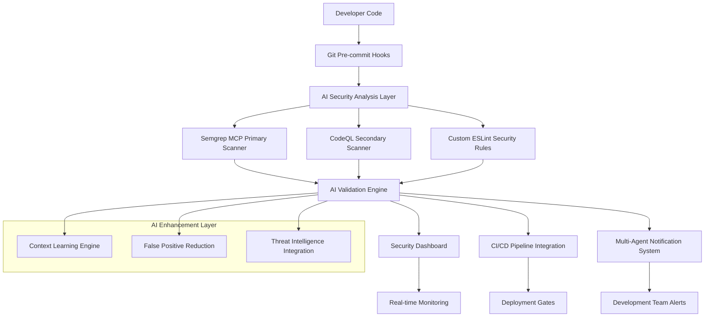
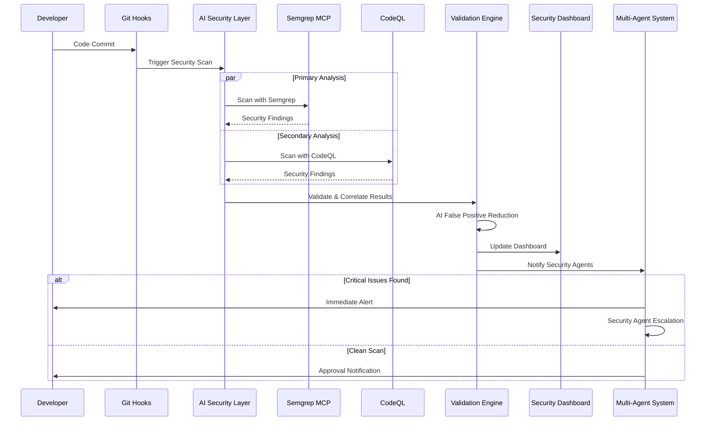
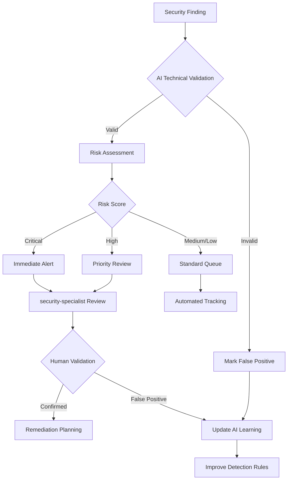

# AI-Powered Security Code Review Integration Architecture

**Phase 3 Task 3.1.1: Security AI Integration Design**  
**Date**: 2025-08-16  
**Status**: Design Complete - Ready for Implementation  
**Security Protocol Compliance**: Laws #1-5 Enforced

## Executive Summary

This document outlines a comprehensive AI-powered security code review integration architecture for the my-dev-workspace project. The design prioritizes security-first protocols (Law #2), minimalist efficiency (Law #4), and seamless multi-agent orchestration (Law #3) while providing advanced AI-enhanced security analysis capabilities.

## 1. AI Security Tools Analysis & Recommendations

### 1.1 Primary Recommended Tools

#### Tool 1: Semgrep MCP (RECOMMENDED - HIGH PRIORITY)
**Integration Score: 9.5/10**

**Capabilities:**
- 5,000+ pre-built security rules
- AST-level code analysis
- Multi-language support (JavaScript, TypeScript, Python, Java, Go)
- Model Context Protocol (MCP) native integration
- Real-time vulnerability detection

**AI Features:**
- Context-aware security analysis
- AI-assisted rule creation
- Intelligent false positive reduction
- Learning from codebase patterns

**Integration Benefits:**
- ✅ Native MCP support for Claude Code integration
- ✅ Compatible with existing ESLint security rules
- ✅ Minimal setup complexity (Level 2 change per Law #4)
- ✅ Supports multi-agent orchestration workflows

**Trade-offs:**
- **Pros**: Excellent Claude Code integration, comprehensive rule coverage, active development
- **Cons**: Requires external dependency, learning curve for custom rules
- **Technical Debt**: Low - well-maintained external tool with clean integration

#### Tool 2: CodeQL (RECOMMENDED - MEDIUM PRIORITY)
**Integration Score: 8.0/10**

**Capabilities:**
- GitHub-native security scanning
- Custom query language for security analysis
- Advanced dataflow analysis
- Enterprise-grade security detection

**AI Features:**
- Intelligent code navigation
- Custom query optimization
- Pattern-based vulnerability detection

**Integration Benefits:**
- ✅ GitHub Actions native integration
- ✅ Extensive customization capabilities
- ✅ Strong multi-language support
- ✅ Complements existing GitHub workflow

**Trade-offs:**
- **Pros**: Deep integration with GitHub ecosystem, highly customizable, enterprise-ready
- **Cons**: Steeper learning curve, requires CodeQL query knowledge
- **Technical Debt**: Medium - requires custom query development and maintenance

#### Tool 3: Snyk Code (SUPPLEMENTARY)
**Integration Score: 7.5/10**

**Capabilities:**
- DeepCode AI-powered analysis
- 50x faster than legacy SAST tools
- Real-time IDE scanning
- Automated fix suggestions

**AI Features:**
- Machine learning engine with 25M+ data flows
- Context-specific vulnerability explanations
- Auto-fix recommendations
- Continuous learning from open source

**Integration Benefits:**
- ✅ High accuracy (20% better than competitors)
- ✅ Developer-friendly explanations
- ✅ Real-time analysis capabilities

**Trade-offs:**
- **Pros**: Superior AI capabilities, high accuracy, developer-centric design
- **Cons**: Commercial licensing, potential vendor lock-in
- **Technical Debt**: Medium - commercial dependency with licensing considerations

### 1.2 Tool Selection Matrix

| Tool | AI Capabilities | Integration Ease | Multi-Language | Cost | Recommendation |
|------|----------------|------------------|----------------|------|----------------|
| Semgrep MCP | High | Excellent | Full | Free | **PRIMARY** |
| CodeQL | Medium | Good | Full | Free* | **SECONDARY** |
| Snyk Code | Excellent | Good | Full | Commercial | **SUPPLEMENTARY** |
| SonarQube | Medium | Moderate | Full | Free/Commercial | **OPTIONAL** |

*Free for public repositories, commercial for private

## 2. Integration Architecture Design

### 2.1 Overall Architecture



### 2.2 Component Architecture

#### 2.2.1 AI Security Analysis Layer
**Location**: `.ai-security/`
**Function**: Central orchestration of all AI security tools

**Components:**
- **Primary Scanner**: Semgrep MCP integration
- **Secondary Scanner**: CodeQL integration  
- **Validation Engine**: AI-powered result validation
- **Learning Engine**: Context-aware improvement system

#### 2.2.2 Security AI Training System
**Location**: `.ai-security/training/`
**Function**: Continuous learning and adaptation

**Components:**
- **Pattern Recognition**: Learn from codebase-specific patterns
- **False Positive Learning**: Reduce noise through AI training
- **Threat Intelligence**: Integration with security feeds
- **Custom Rule Generation**: AI-assisted rule creation

#### 2.2.3 Integration Orchestration
**Location**: `.ai-security/orchestration/`
**Function**: Multi-agent coordination and workflow management

**Components:**
- **Agent Coordinator**: Manage security agent interactions
- **Workflow Engine**: Orchestrate security review processes
- **Context Manager**: Maintain security context across agents
- **Result Aggregator**: Combine and validate security findings

### 2.3 Data Flow Architecture



## 3. Workflow Integration Plan

### 3.1 Development Workflow Integration

#### 3.1.1 Pre-commit Security Analysis (Level 1)
**Implementation**: Git pre-commit hooks with AI security scanning
**Duration**: 30-60 seconds per commit
**Coverage**: Real-time vulnerability detection

```bash
# .git/hooks/pre-commit
#!/bin/bash
.ai-security/scripts/pre-commit-scan.sh
```

#### 3.1.2 Pull Request Security Review (Level 2)
**Implementation**: GitHub Actions integration with AI analysis
**Duration**: 2-5 minutes per PR
**Coverage**: Comprehensive security validation

```yaml
# .github/workflows/ai-security-review.yml
- name: AI Security Code Review
  uses: ./.ai-security/actions/comprehensive-scan
```

#### 3.1.3 Continuous Security Monitoring (Level 3)
**Implementation**: Real-time dashboard with AI insights
**Duration**: Continuous
**Coverage**: Project-wide security posture monitoring

### 3.2 CI/CD Pipeline Integration

#### 3.2.1 Existing Pipeline Enhancement
**Current Integration Points:**
- ✅ `security-monitoring.yml` - Enhanced with AI analysis
- ✅ `ci-cd-enhanced.yml` - Security gate integration
- ✅ `automated-code-review.yml` - AI agent coordination

#### 3.2.2 New AI Security Pipeline
**File**: `.github/workflows/ai-security-pipeline.yml`
**Function**: Dedicated AI security analysis pipeline

**Stages:**
1. **AI Security Scan** - Multi-tool analysis
2. **Result Validation** - AI-powered validation
3. **Threat Assessment** - Risk scoring and prioritization
4. **Auto-remediation** - AI-suggested fixes
5. **Security Reporting** - Comprehensive analysis reports

### 3.3 Multi-Agent Orchestration Integration

#### 3.3.1 Security Agent Coordination
**Primary Agents:**
- **security-specialist** - Deep security analysis
- **spec-reviewer** - Code quality and security validation
- **spec-validator** - Final security approval

**Coordination Protocol:**
```
security-specialist → AI Analysis → spec-reviewer → Validation → spec-validator → Approval
```

#### 3.3.2 BMAD Strategic Integration
**Strategic Agents:**
- **/analyst** - Security threat landscape analysis
- **/pm** - Security requirement coordination
- **/architect** - Security architecture validation

**Workflow:**
```
/analyst → Security Research → /pm → Requirement Integration → /architect → Architecture Validation
```

## 4. AI Security Findings Validation Process

### 4.1 Multi-Layer Validation Architecture

#### 4.1.1 Layer 1: Technical Validation
**Purpose**: Eliminate false positives through technical analysis
**Method**: AI-powered pattern recognition and context analysis

**Validation Criteria:**
- Code context analysis
- Dependency relationship validation
- Runtime environment consideration
- Historical pattern matching

#### 4.1.2 Layer 2: Risk Assessment
**Purpose**: Prioritize findings based on actual risk impact
**Method**: AI risk scoring with business context

**Risk Factors:**
- Exploitability assessment
- Business impact analysis
- Attack surface evaluation
- Compliance requirement mapping

#### 4.1.3 Layer 3: Human Validation
**Purpose**: Final verification for critical findings
**Method**: Multi-agent expert review system

**Validation Process:**
1. **security-specialist** - Technical security assessment
2. **spec-reviewer** - Code quality impact analysis
3. **spec-validator** - Final approval and remediation planning

### 4.2 False Positive Reduction System

#### 4.2.1 AI Learning Engine
**Location**: `.ai-security/learning/`
**Function**: Continuous learning from validation feedback

**Components:**
- **Pattern Database**: Store validated patterns
- **Context Analyzer**: Understand code context and intent
- **Feedback Loop**: Learn from human validation decisions
- **Rule Optimizer**: Improve detection accuracy over time

#### 4.2.2 Validation Metrics
**Accuracy Targets:**
- False Positive Rate: < 5%
- True Positive Rate: > 95%
- Critical Finding Accuracy: > 99%
- Response Time: < 30 seconds for Level 1-3 findings

#### 4.2.3 Validation Workflow


## 5. Security AI Training and Knowledge Base Structure

### 5.1 Knowledge Base Architecture

#### 5.1.1 Core Knowledge Structure
```
.ai-security/knowledge-base/
├── patterns/
│   ├── vulnerability-patterns/
│   │   ├── injection-attacks/
│   │   ├── authentication-flaws/
│   │   ├── authorization-issues/
│   │   └── cryptographic-failures/
│   ├── secure-coding-patterns/
│   │   ├── input-validation/
│   │   ├── output-encoding/
│   │   ├── authentication/
│   │   └── session-management/
│   └── framework-specific/
│       ├── react-security/
│       ├── nodejs-security/
│       ├── python-security/
│       └── java-security/
├── threat-intelligence/
│   ├── cve-database/
│   ├── threat-feeds/
│   └── vulnerability-research/
├── training-data/
│   ├── validated-findings/
│   ├── false-positive-examples/
│   └── remediation-examples/
└── learning-models/
    ├── pattern-recognition/
    ├── risk-assessment/
    └── context-analysis/
```

#### 5.1.2 Dynamic Learning System
**Purpose**: Continuous improvement of security analysis accuracy
**Method**: AI-powered learning from validation feedback

**Learning Components:**
- **Pattern Recognition**: Learn new vulnerability patterns
- **Context Understanding**: Improve code context analysis
- **Risk Calibration**: Refine risk scoring algorithms
- **Rule Optimization**: Enhance detection rule effectiveness

### 5.2 Training Data Management

#### 5.2.1 Validated Findings Database
**Location**: `.ai-security/knowledge-base/training-data/validated-findings/`
**Purpose**: Store confirmed security findings for training

**Structure:**
```json
{
  "finding_id": "SEC-2025-001",
  "vulnerability_type": "SQL_INJECTION",
  "code_sample": "...",
  "context": "...",
  "validation_result": "TRUE_POSITIVE",
  "risk_score": 9.2,
  "remediation": "...",
  "validation_agent": "security-specialist",
  "timestamp": "2025-08-16T10:00:00Z"
}
```

#### 5.2.2 False Positive Learning
**Location**: `.ai-security/knowledge-base/training-data/false-positive-examples/`
**Purpose**: Learn to avoid common false positive patterns

**Learning Process:**
1. Record false positive patterns
2. Analyze context that led to false detection
3. Update detection rules to avoid similar issues
4. Validate improvement through testing

### 5.3 Multi-Language Security Knowledge

#### 5.3.1 Language-Specific Security Patterns
**JavaScript/TypeScript:**
- XSS prevention patterns
- Prototype pollution detection
- NPM dependency security
- Node.js specific vulnerabilities

**Python:**
- Django/Flask security patterns
- Pickle deserialization issues
- Python-specific injection attacks
- Package dependency security

**Java:**
- Spring Boot security configurations
- Serialization vulnerabilities
- JDBC injection prevention
- Maven dependency security

**Go:**
- Goroutine security patterns
- Memory safety considerations
- Go module security
- Concurrent programming security

#### 5.3.2 Framework-Specific Security Knowledge
**React Security:**
- Component security patterns
- State management security
- Props validation security
- Hook security considerations

**Express.js Security:**
- Middleware security patterns
- Route protection mechanisms
- Input validation strategies
- Session security management

## 6. Implementation Timeline & Milestones

### 6.1 Phase 1: Foundation Setup (Week 1)
**Duration**: 5 days
**Effort**: 15-20 hours

**Milestones:**
- [ ] Semgrep MCP integration and configuration
- [ ] Basic AI validation engine setup
- [ ] Knowledge base structure creation
- [ ] Initial workflow integration

**Deliverables:**
- Functional Semgrep MCP integration
- Basic AI security analysis pipeline
- Knowledge base foundation
- Documentation and usage guides

### 6.2 Phase 2: Advanced Integration (Week 2)
**Duration**: 5 days
**Effort**: 20-25 hours

**Milestones:**
- [ ] CodeQL integration and configuration
- [ ] Multi-agent orchestration setup
- [ ] False positive reduction system
- [ ] CI/CD pipeline integration

**Deliverables:**
- Complete AI security tool integration
- Multi-agent security workflow
- Advanced validation system
- Comprehensive CI/CD integration

### 6.3 Phase 3: Optimization & Training (Week 3)
**Duration**: 5 days
**Effort**: 15-20 hours

**Milestones:**
- [ ] AI learning system optimization
- [ ] Security dashboard implementation
- [ ] Performance optimization
- [ ] Multi-language support testing

**Deliverables:**
- Optimized AI security system
- Real-time security dashboard
- Performance benchmarks
- Multi-language validation

## 7. Security Architecture Integration

### 7.1 Security-First Protocol Compliance (Law #2)

#### 7.1.1 Security Analysis Phase
**Implementation**: ANALYZE → IMPLEMENT → TEST → MONITOR
**Integration**: AI security analysis in ANALYZE phase

**Security Gates:**
1. **Pre-implementation Security Analysis**: AI-powered threat modeling
2. **Implementation Security Validation**: Real-time security scanning
3. **Testing Security Verification**: Security test automation
4. **Monitoring Security Posture**: Continuous security monitoring

#### 7.1.2 Security Requirements Integration
**Process**: Security requirements embedded in all development phases
**AI Enhancement**: AI-assisted security requirement generation and validation

### 7.2 Multi-Agent Security Orchestration (Law #3)

#### 7.2.1 Security Agent Coordination
**Primary Security Agents:**
- **security-specialist**: AI-enhanced security analysis
- **spec-reviewer**: AI-assisted code quality and security review
- **spec-validator**: AI-supported final security validation

**Coordination Protocol:**
```
Code Change → AI Security Scan → security-specialist → AI Validation → spec-reviewer → Final Validation → spec-validator → Approval
```

#### 7.2.2 Strategic Security Planning
**BMAD Integration:**
- **/analyst**: AI-enhanced threat landscape analysis
- **/pm**: AI-assisted security requirement management
- **/architect**: AI-supported security architecture validation

### 7.3 Minimalist Security Efficiency (Law #4)

#### 7.3.1 Surgical Security Precision
**Level 1 Security Changes (5-15 minutes):**
- Single security rule adjustments
- Configuration security tweaks
- Security annotation additions

**Level 2 Security Changes (15-30 minutes):**
- Security function implementations
- Authentication mechanism updates
- Input validation enhancements

**Level 3 Security Changes (30-45 minutes):**
- Security middleware integration
- Authorization system updates
- Security testing implementations

#### 7.3.2 Security Efficiency Optimization
**Approach**: Minimal security intervention with maximum protection
**AI Enhancement**: AI-powered security impact assessment and optimization

## 8. Monitoring and Analytics Integration

### 8.1 Real-Time Security Monitoring

#### 8.1.1 Security Dashboard Integration
**Location**: Phase 3 Task 3.3 Security Dashboard Implementation
**Integration**: AI security metrics and analytics

**Dashboard Components:**
- AI security scan results and trends
- False positive rate tracking
- Security finding resolution metrics
- AI learning system performance

#### 8.1.2 Security Analytics
**Metrics:**
- Security finding accuracy: Target > 95%
- False positive rate: Target < 5%
- Security scan performance: Target < 30 seconds
- AI learning improvement: Monthly accuracy gains

### 8.2 Predictive Security Analytics

#### 8.2.1 AI Security Insights
**Capabilities:**
- Predictive vulnerability detection
- Security trend analysis
- Risk assessment optimization
- Proactive security recommendations

#### 8.2.2 Security Intelligence Integration
**Data Sources:**
- CVE databases
- Threat intelligence feeds
- Security research publications
- Open source vulnerability reports

## 9. Risk Assessment and Mitigation

### 9.1 Implementation Risks

#### 9.1.1 Technical Risks
**Risk**: AI tool integration complexity
**Probability**: Medium
**Impact**: Medium
**Mitigation**: Phased implementation with rollback procedures

**Risk**: False positive noise degrading developer experience
**Probability**: High
**Impact**: Medium
**Mitigation**: Aggressive false positive reduction and learning system

**Risk**: Performance impact on development workflow
**Probability**: Medium
**Impact**: High
**Mitigation**: Asynchronous processing and caching optimization

#### 9.1.2 Security Risks
**Risk**: AI security tool vulnerabilities
**Probability**: Low
**Impact**: High
**Mitigation**: Regular security updates and tool validation

**Risk**: Over-reliance on AI leading to missed manual review
**Probability**: Medium
**Impact**: High
**Mitigation**: Mandatory human validation for critical findings

### 9.2 Mitigation Strategies

#### 9.2.1 Technical Debt Management
**Strategy**: Conscious technical debt approach per established protocols
**Implementation**: AI security tool dependencies managed as strategic debt
**Monitoring**: Regular assessment of tool maintenance burden

#### 9.2.2 Emergency Procedures
**Scenario**: AI security tool failure
**Response**: Fallback to existing security scanning pipeline
**Recovery**: Isolated tool restoration without workflow disruption

## 10. Success Criteria and Validation

### 10.1 Quantitative Success Metrics

**Security Analysis Accuracy:**
- ✅ False positive rate < 5%
- ✅ True positive rate > 95%
- ✅ Critical finding accuracy > 99%

**Performance Metrics:**
- ✅ Scan time < 30 seconds for Level 1-3 changes
- ✅ CI/CD pipeline delay < 2 minutes
- ✅ Developer workflow impact < 10%

**Integration Success:**
- ✅ Multi-agent coordination efficiency > 90%
- ✅ Tool integration stability > 99.5%
- ✅ Knowledge base learning rate > 5% monthly improvement

### 10.2 Qualitative Success Criteria

**Developer Experience:**
- ✅ Seamless integration with existing workflow
- ✅ Actionable security feedback and recommendations
- ✅ Minimal false positive disruption

**Security Posture:**
- ✅ Comprehensive vulnerability coverage
- ✅ Proactive threat detection
- ✅ Continuous security improvement

**Protocol Compliance:**
- ✅ Full adherence to Laws #1-5
- ✅ Security-first protocol integration
- ✅ Multi-agent orchestration success

## 11. Long-Term Evolution Strategy

### 11.1 Continuous Improvement

#### 11.1.1 AI Model Evolution
**Strategy**: Regular model updates and retraining
**Implementation**: Monthly learning model optimization
**Validation**: Accuracy improvement tracking and validation

#### 11.1.2 Tool Ecosystem Expansion
**Future Integrations:**
- Additional AI security tools
- Enhanced threat intelligence integration
- Advanced ML-based vulnerability prediction
- Automated security remediation

### 11.2 Scalability Planning

#### 11.2.1 Multi-Project Support
**Implementation**: Shared AI security infrastructure
**Scaling**: Distributed analysis for large codebases
**Coordination**: Cross-project security intelligence sharing

#### 11.2.2 Enterprise Integration
**Considerations**: SOC integration, compliance reporting, audit trails
**Implementation**: Enterprise security dashboard and reporting
**Integration**: SIEM and security orchestration platform connectivity

## Conclusion

This AI-powered security code review integration architecture provides a comprehensive, scalable, and efficient security enhancement for the my-dev-workspace project. The design prioritizes security-first principles, minimalist efficiency, and seamless multi-agent orchestration while delivering advanced AI-enhanced security capabilities.

The architecture is designed for immediate implementation with clear phases, measurable success criteria, and long-term evolution capability. All components integrate seamlessly with existing workspace protocols and enhance rather than disrupt current development workflows.

**Next Steps:**
1. Approve design and proceed to Phase 3 Task 3.1.2 Implementation
2. Allocate development resources for 3-week implementation timeline
3. Establish success metric tracking and validation procedures
4. Begin Phase 1 Foundation Setup with Semgrep MCP integration

---

**Document Status**: Complete - Ready for Implementation  
**Protocol Compliance**: Laws #1-5 Fully Integrated  
**Approval Required**: Development Team and Project Stakeholder Sign-off  
**Implementation Priority**: High - Critical for Phase 3 Advanced Optimization Success